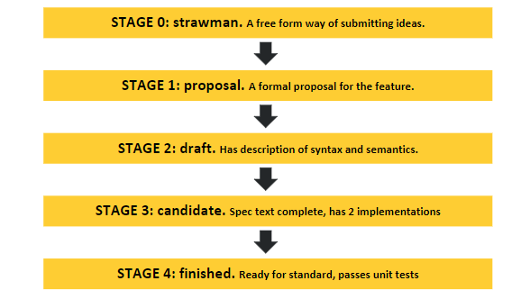

# ECMAScript

European Computer Manufacturers Association

<!-- vertical -->

## ECMAScript & JavaScript

> **ECMAScript** (or **ES**) is a scripting-language specification standardized by [Ecma International](https://en.wikipedia.org/wiki/Ecma_International) in **ECMA-262** and ISO/IEC 16262. It was created to standardize [JavaScript](https://en.wikipedia.org/wiki/JavaScript), so as to foster multiple independent implementations. JavaScript has remained the best-known implementation of ECMAScript since the standard was first published, with other well-known implementations including [JScript](https://en.wikipedia.org/wiki/JScript) and [ActionScript](https://en.wikipedia.org/wiki/ActionScript).

Note: [ECMAScript - Wikipedia](https://en.wikipedia.org/wiki/ECMAScript "")

<!-- vertical -->
ES5 -> ECMAScript 2009

ES6 -> ECMAScript 2015 (and after)


<!-- vertical -->

[The TC39 Process](https://tc39.github.io/process-document/ "")



Note: [tc39/proposals: Tracking ECMAScript Proposals](https://github.com/tc39/proposals "")


<!-- vertical -->

## ECMAScript Syntax

<!-- vertical -->

### `var`, `let` and `const`


Always define variable as `const`, use `let` unless you know its reference will be changed.

<!-- vertical -->

```javascript
var a = 'a';
let b = 'b';
const c = {'c':'c'};

// global scope
window.a // "a"
window.b // undefined
window.c // undefined

// can be reassigned
a = 'a1'; // "a1"
b = 'b1'; // "b1"
c = 'c1'; // Uncaught TypeError: Assignment to constant variable.
c.c = 'd'; // {c: "d"}

```

<!-- vertical -->

```js
// function scope
let func = function () {
	var i = 1;
	let j = 2;
	const k = 3;
	console.log(i);
	console.log(j);
	console.log(k);
}
func(); // 1 2 3
console.log(i); // Uncaught ReferenceError: i is not defined
console.log(j); // Uncaught ReferenceError: j is not defined
console.log(k); // Uncaught ReferenceError: k is not defined

```

<!-- vertical -->

```js
// block scope 1
{
	var x = 4;
	let y = 5;
	const z = 6;
}
console.log(x); // 4
console.log(y); // Uncaught ReferenceError: y is not defined
console.log(z); // Uncaught ReferenceError: z is not defined

// block scope 2  for-loop has two block scopes
for (var v = 1; v < 3; v++) {
	var v_ = v;
}
console.log(v);  // 3
console.log(v_); // 2

for (let t = 1; t < 3; t++) {
	let t_ = t;
}
console.log(t);  // Uncaught ReferenceError: t is not defined
console.log(t_); // Uncaught ReferenceError: t_ is not defined
```

<!-- vertical -->

### Symbol

* `Symbol('description')`
* Primary datatype
* To generate a globally unique value
* Can be used as object key

<!-- vertical -->

```javascript
let a1 = Symbol('a');
let a2 = Symbol('a');
a1 === a2 // false
obj[a1] = 'a1';

log.levels = {
  DEBUG: Symbol('debug'),
  INFO: Symbol('info'),
  WARN: Symbol('warn'),
};
log(log.levels.DEBUG, 'debug message');
log(log.levels.INFO, 'info message');
```

Note: [Metaprogramming in ES6: Symbols and why they're awesome](https://www.keithcirkel.co.uk/metaprogramming-in-es6-symbols/ "")

<!-- vertical -->

### Equal and Strict Equal

* `===` and `!==` are strict equal/unequal for primitive types
* `==` and `!=` will do implicit type conversion before comparison
* you should use `===` in almost **ALL** cases

```js
0 ==  false        // true
0 === false        // false, because they are of a different type
1 ==  "1"          // true, automatic type conversion for value only
1 === "1"          // false, different type
null ==  undefined // true
null === undefined // false
'0' == false       // ture
'0' === false      // false
```

Note:

[Which equals operator (== vs ===) should be used in JavaScript comparisons? - Stack Overflow](https://stackoverflow.com/questions/359494/which-equals-operator-vs-should-be-used-in-javascript-comparisons "")
[Equality comparisons and sameness - JavaScript | MDN](https://developer.mozilla.org/en-US/docs/Web/JavaScript/Equality_comparisons_and_sameness "")

<!-- vertical -->

For reference type, `==` and `===` are identical except:

```js
var a = [1,2,3];
var b = [1,2,3];

var c = { x: 1, y: 2 };
var d = { x: 1, y: 2 };

a == b            // false
a === b           // false

c == d            // false
c === d           // false

// Special case
"abc" == new String("abc")    // true
"abc" === new String("abc")   // false
```

<!-- vertical -->

### JSON

A simple `package.json`
```json
{
	"name": "npm-start",
	"version": "1.0.0",
	"description": "init",
	"main": "index.js",
	"scripts": {
		"test": "echo \"Error: no test specified\" && exit 1"
	},
	"author": "foobar",
	"license": "ISC",
	"keywords": [
		"react",
		"node"
	]
}
```

<!-- vertical -->

* **J**ava**S**cript **O**bject **N**otation is a subset of JavaScript object syntax.
* JSON requires double quotes to be used around strings and property names. Single quotes are not valid.
* Even a single misplaced comma or colon can cause a JSON file to go wrong, and not work.
* No comments allowed for standard (strict) JSON
* Deep copy object: `JSON.parse(JSON.stringify(obj))`

Note: [JSON.org](https://www.json.org/ "")

<!-- vertical -->

### JavaScript Object Syntax

```javascript
let home = "home address";
let phone = "123456";

let person = {
	"first name"  :   "fname",
	'middle name' :   "mname",
	last_name     :   "lname",
	home          :   "hangzhou",
	[home]        :   "sandun",
	phone
};
JSON.stringify(person);
/* {"first name":"fname","middle name":"mname","last_name":"lname",
"home":"hangzhou","home address":"sandun","phone":"123456"} */
```

<!-- vertical -->

### Destructuring Assignment

> Syntax of extracting values from an array or object and assign to variables

```js
let [a, b, c] = [1, 2]; // a:1 b:2 c:undefined
let [x, y = 'b'] =  ['a']; // x:'a' y:'b'

let {foo: f, bar} = { foo: 'aaa', bar: 'bbb'};
f // "aaa"
bar // "bbb"

function example() {
	return {
		foo: 1,
		bar: 2
	};
}
let {foo, bar} = example();
```

Note:

[Destructuring assignment - JavaScript | MDN](https://developer.mozilla.org/en-US/docs/Web/JavaScript/Reference/Operators/Destructuring_assignment "")

<!-- vertical -->

### `...` Rest/Spread Operator

```js
// Rest properties collect the remaining own enumerable property keys 
// that are not already picked off by the destructuring pattern. Those 
// keys and their values are copied onto a new object.
let { x, y, ...z } = { x: 1, y: 2, a: 3, b: 4 };
x; // 1
y; // 2
z; // { a: 3, b: 4 }

// Spread properties in object initializers copies own enumerable 
// properties from a provided object onto the newly created object.
let n = { x, y, a: 99, ...z, b: 99 }; // !! sequence does matter
n; // {x: 1, y: 2, a: 3, b: 99}
```

<!-- vertical -->

```js
// spread operator is shallow copy
const arr = [1, 2, 3];
const arr2 = [...arr]; // like arr.slice()
arr === arr2; // false
arr2.push(4); 
// arr2 becomes [1, 2, 3, 4]
// arr remains unaffected

const original = {a: {b: 1}};
const copy = {...original};
copy.a.b = 2;
console.log(copy);     // {a: {b: 2}}
console.log(original); // {a: {b: 2}}
```

Note: 

[Spread syntax - JavaScript | MDN](https://developer.mozilla.org/en-US/docs/Web/JavaScript/Reference/Operators/Spread_syntax "")

[Rest parameters - JavaScript | MDN](https://developer.mozilla.org/en-US/docs/Web/JavaScript/Reference/Functions/rest_parameters "")

[tc39/proposal-object-rest-spread: Rest/Spread Properties for ECMAScript](https://github.com/tc39/proposal-object-rest-spread "")

<!-- vertical -->

```js
var oldObject = {
  name: 'A',
  address: {
    street: 'Station Road',
    city: 'Pune'
  }
}
var newObject = JSON.parse(JSON.stringify(oldObject));

newObject.address.city = 'Delhi';
console.log(newObject);
console.log(oldObject);
```

<!-- vertical -->

`Object.assign`

```js
let target1 = {a : 1, b : 2};
let source1 = {b : 2, c : 3};
let source2 = {b : 5, d : 6};

// Copy properties from each source to the target.
// Note: this WILL MUTATE THE TARGET!
Object.assign(target1, source1, source2);
const target2 = Object.assign({}, source1, source2);
console.log(target1); // {a : 1, b : 5, c : 3, d : 6}
console.log(target2); // {b: 5, c: 3, d: 6}
target1 === target2;
```

<!-- vertical -->

Array is special object with numerical keys

```js
let arr = [1, 2, 3];
arr.hasOwnProperty(0); // true
arr[6] = 6;
arr; // [1, 2, 3, empty × 3, 6]
Object.keys(arr); // ["0", "1", "2", "6"]
Object.values(arr);
Object.entries(arr);

// `slice()` create a new array reference with the same contents
let arr1 = ["a", "b", "c", "d", "e"];
let arr2 = arr1.slice();
arr1 === arr2; // false
arr2[3] = "c1"
console.log(arr1); // ["a", "b", "c", "d", "e"]
console.log(arr2); // ["a", "b", "c", "c1", "e"]
```

<!-- vertical -->

### Shallow/Deep Copy Object
* Shallow
	- spread operator `...`
	- `Object.assign({}, ...sources)`
	- `Array.prototype.slice()`
* Deep
	- `JSON.parse(JSON.stringify(obj))`
	- lodash `_.cloneDeep(value)`

Note: 

[javascript - Deep copy in ES6 using the spread syntax - Stack Overflow](https://stackoverflow.com/questions/38416020/deep-copy-in-es6-using-the-spread-syntax "")

[Spread Operator Does Not Deep Copy Properties - Bambielli’s Blog](https://bambielli.com/til/2017-01-29-spread-operator-deep-copy/ "")

[Object.assign() - JavaScript | MDN](https://developer.mozilla.org/en-US/docs/Web/JavaScript/Reference/Global_Objects/Object/assign "")

[How to deep clone a JavaScript object](https://flaviocopes.com/how-to-clone-javascript-object/ "")

<!-- vertical -->

### Arrow Function

* Make function declaration simpler
* Automatically bind `this` of the scope when defined
* Arrow functions cannot be used as constructors and will throw an error when used with new

Note: 

[Arrow functions - JavaScript | MDN](https://developer.mozilla.org/en-US/docs/Web/JavaScript/Reference/Functions/Arrow_functions "")

Default parameter

```js
// Evaluated at call time
function append(value, array = []) {
  array.push(value);
  return array;
}
append(1); //[1]
append(2); //[2], not [1, 2]
```

[Default parameters - JavaScript | MDN](https://developer.mozilla.org/en-US/docs/Web/JavaScript/Reference/Functions/Default_parameters "")
<!-- vertical -->

```js
// with rest operator
const headAndTail = (head, ...tail) => [head, tail];
headAndTail(1, 2, 3, 4, 5);
// [1,[2,3,4,5]]

// ES6 arrow function with destruction assignment
const full = ({ first, last }) => first + " " + last; // note the {}
// ES5 equivalence
function full(person) {
	return person.first + " " + person.last;
}
```

<!-- vertical -->

```js
// ES6
function foo() {
	setTimeout( () => {
		// Automatically bind this to window
		console.log('id:', this.id);
		// console.log('this', this);
	}, 1000);
}

// ES5 equivalence
function foo() {
	var _this = this; // this is window

	setTimeout( function() {
		console.log('id:', _this.id);
		// console.log('this', this);
	}, 1000);
}
```

<!-- vertical -->

### Promise

* Make callback hell to chaining syntax
* A promise has 3 states:
	- **Pending**	when async operation not finished yet
	- **Fulfilled**	when async operation *successful*
	- **Rejected**	when async operation *failed*

Note:
[Using promises - JavaScript | MDN](https://developer.mozilla.org/en-US/docs/Web/JavaScript/Guide/Using_promises "")
[Promise - JavaScript | MDN](https://developer.mozilla.org/en-US/docs/Web/JavaScript/Reference/Global_Objects/Promise "")

<!-- vertical -->

```javascript
// ES6 callback hell
doSomething(function(result) {
  doSomethingElse(result, function(newResult) {
    doThirdThing(newResult, function(finalResult) {
      console.log('Got the final result: ' + finalResult);
    }, failureCallback);
  }, failureCallback);
}, failureCallback);

// ES6 chaining callback
doSomething()
.then(function(result) {
  return doSomethingElse(result);
})
.then(function(newResult) {
  return doThirdThing(newResult);
})
.then(function(finalResult) {
  console.log('Got the final result: ' + finalResult);
})
.catch(failureCallback);
```

<!-- vertical -->


Note: 


<!-- vertical -->


<!-- vertical -->

* `Promise.prototype.then(onFulfilled[, onRejected])`
* `Promise.prototype.catch(onRejected)`
	- = `Promise.prototype.then(null, onRejected)`
* Both return a new Promise object

```javascript
p.then((value) => {
  // fulfillment
}, (reason) => {
  // rejection
});

p.catch(function(reason) {
   // rejection
});
```

Note:
[An Introduction to Promises in JS | en.proft.me ](https://en.proft.me/2018/07/24/introduction-promises-js/ "")

<!-- vertical -->

```js
let promise = new Promise(function(resolve, reject) {
	console.log("Promise"); // log when define promise
	resolve();
});

promise.then(function() {
	console.log('Resolved');
	// log when async operation finish or by then end of current event loop
});

console.log('Hi'); // log after promise definition
/*
Promise
Hi
Resolved
*/
```

<!-- vertical -->

### `class`

```js
class Animal {
	constructor(name) {
		this.name = name;
	}

	sayMyName() {
		console.log('My name is ' + this.name);
	}
}

class Programmer extends Animal {
	constructor(name) {
		super(name); // must have super() otherwise error
	}

	program() {
		console.log("I'm coding...");
	}
}

let animal = new Animal('kitty');
let programmer = new Programmer('react');
animal.sayMyName();     // My name is kitty
programmer.sayMyName(); // My name is react
programmer.program();   // I'm coding...
```

<!-- vertical -->

* bind this for function in constructor or use arrow function

```js
class Logger {
	printName(name = 'there') {
		this.print(`Hello ${name}`);
	}

	print(text) {
		console.log(text);
	}
}
const logger = new Logger();
logger.printName(); // Hello there

const { printName } = logger;
printName(); // Uncaught TypeError: Cannot read property 'print' of undefined
```


<!-- vertical -->


### decorator

* Can decorate class, class attribute, but not function
* Looks like Java annotation, but essentially they're totally different

```js
@decorator
class A {}

// equivalent to

class A {}
A = decorator(A) || A;
```

<!-- vertical -->

```js
function dec(id) {
	console.log('dec entered: ' + id);
	return function(target) {
		console.log('dec executed: ' + id);
	}
}

@dec(1)
@dec(2)
class MyClass {}
// dec entered: 1
// dec entered: 2
// dec executed: 2
// dec executed: 1
```

<!-- vertical -->

### Function As First-class Entity

- refer to it from constants and variables
- pass it as a parameter to other functions
- return it as result from other functions

Note:

[Functional Programming Principles in Javascript](https://www.freecodecamp.org/news/functional-programming-principles-in-javascript-1b8fc6c3563f/ "")

<!-- vertical -->

> A higher order function is a function that takes a function as an argument, or returns a function.

```javascript
const sayHello = function() {
   return function() {
      console.log("Hello!");
   }
}

const myFunc = sayHello();
myFunc.toString();
/* 
function() {
  console.log("Hello!");
}
*/
myFunc(); // Hello!

sayHello()(); Hello!
```

<!-- vertical -->

> Currying is a transformation of functions that translates a function from callable as `f(a, b, c)` into callable as `f(a)(b)(c)`

```js
const common = (x, y, z) => x + y * z;
common(2, 3, 4); // 14

const curry = x => y => z => x + y * z; // curried form
curry(2)(3)(4); // 14

// easy to compose functions
const compose = (f, g) => x => f(g(x));
const add1 = x => x + 1;
const mult2 = x => x * 2;
compose(add1, mult2)(2); // 5
compose(mult2, add1)(2); // 6
```

Note: [Curry and Function Composition - JavaScript Scene - Medium](https://medium.com/javascript-scene/curry-and-function-composition-2c208d774983 "")

<!-- vertical -->

### Pure Function

* It returns the same result if given the same arguments
* It does not cause any observable side effects

Note: 

[reactjs - Redux: Why making a shallow copy of one level of the state is a mistake? - Stack Overflow](https://stackoverflow.com/questions/44258716/redux-why-making-a-shallow-copy-of-one-level-of-the-state-is-a-mistake "")

[javascript - Why is it considered ok to mutate a shallow copy of my state? - Stack Overflow](https://stackoverflow.com/questions/39078819/why-is-it-considered-ok-to-mutate-a-shallow-copy-of-my-state "")

<!-- vertical -->

### Array Functions

- **`forEach()`**: doesn't return anything, but lets you do something with each original value
- **`map()`**: creates a new array with one value for each item in the original array
- **`filter()`**: creates a new array containing only the original values where the callback returned `true`
- **`reduce()`**: produces one new value based on the contents of the original array

<!-- vertical -->


Note:

TODO: 

[Swift Guide to Map Filter Reduce](https://useyourloaf.com/blog/swift-guide-to-map-filter-reduce/ "")


<!-- vertical -->

```js
// forEach, map, reduce, filter
const values = [3, 5, 8, 10, 13];

const logValue = (num) => console.log(num);
values.forEach(logValue);
// prints: 3, 5, 8, 10, 13

const timesTwo = (num) => num * 2;
const doubledNumbers = values.map(timesTwo);
// [6, 10, 16, 20, 26]

const isEven = (num) => num % 2 === 0;
const evenNumbers = values.filter(isEven);
// [8, 10]

const addNumbers = (lastResult, currentValue) => {
    return lastResult + currentValue;
}
const sum = values.reduce(addNumbers, 0);
// 39
```

<!-- vertical -->

**pipeline**

```js
// use output of prvious function as input of next function
const pipeline = (...funcs) => value => funcs.reduce( (f, g) => g(f), value);

const plus1 = a => a + 1;
const mult2 = a => a * 2;
const square = a => a ** 2;

pipeline(plus1, mult2, square)(5); // 144
square(mult2(plus1(5))); // 144, equivalence
pipeline(square, plus1, mult2)(2); // 10
```

<!-- vertical -->

```javascript
// reduceRight() is reduce() from right to left
const compose = (...funcs) => x => funcs.reduceRight((y, f) => f(y), x);

const trace = label => value => {
  console.log(`${ label }: ${ value }`);
  return value;
};

const g = n => n + 1;
const f = n => n * 2;

const h = compose(
  trace('after f'),
  f,
  trace('after g'),
  g
);

h(20);
// after g: 21
// after f: 42
```


<!-- vertical -->

write map using reduce
1. initial state is `[]`
2. iterate on target array and append result to accumulator `mappedArray`

```javascript
if (!Array.prototype.mapUsingReduce) {
  Array.prototype.mapUsingReduce = function(callback, thisArg) {
    return this.reduce(function(mappedArray, currentValue, index, array) {
      mappedArray[index] = callback.call(thisArg, currentValue, index, array);
      return mappedArray;
    }, []);
  };
}

[1, 2, , 3].mapUsingReduce(
  (currentValue, index, array) => currentValue + index + array.length
); // [5, 7, , 10]
```

<!-- vertical -->

### Module

* CommonJS
	- load modules synchronously
	- mainly used in server side (Node.js)
* AMD
	- load modules asynchronously
	- used mostly in traditional front-end
* ES6 Module

<!-- vertical -->


### CommonJS

Load at run time

```js
// CommonJS Module
let { stat, exists, readFile } = require('fs');

// equivalent to 
let _fs = require('fs');
let stat = _fs.stat;
let exists = _fs.exists;
let readFile = _fs.readFile;
```

<!-- vertical -->

### ES6 Module

Load at comile time

```javascript
// circle.js
const PI = 3.14;
const circle_area = function (r) {
    return PI * r * r;
}

export {PI, circle_area};
export default function(r) { // only one default export
    return 2 * PI * r;
};

// circle_calc.js
// default import not wrapped with {}
import length, {PI, circle_area as area} from './circle';

let r = 10;
console.log(PI);         // 3.14
console.log(area(r));    // 314
console.log(length(r));  // 62.800000000000004
```
<!-- vertical -->

### Console logging output

* Result depends on implementation of run time environment

```js
let obj = { name: 'a', id: 123 };

console.log('init obj JSON: ' + JSON.stringify(obj, null, 2));
// !!! obj re-evaluated when expanded in browser console
console.log('init obj: ', obj);
console.log('init obj clone: ', JSON.parse(JSON.stringify(obj))); 

obj.id = 111;

console.log('updated obj JSON: ' + JSON.stringify(obj, null, 2));
console.log('updated obj: ', obj);
console.log('updated obj clone: ', JSON.parse(JSON.stringify(obj)));
```

Note: [javascript - Weird behavior with objects &amp; console.log - Stack Overflow](https://stackoverflow.com/questions/23429203/weird-behavior-with-objects-console-log "")