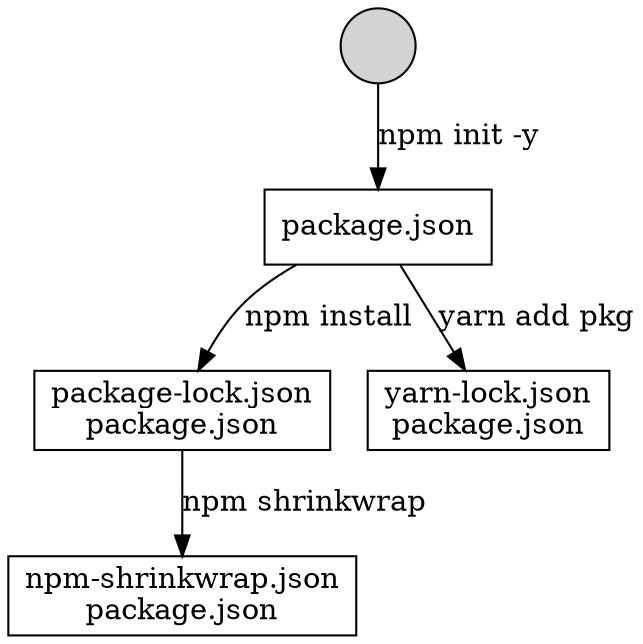

# Node.js

> Node.js is an open-source, cross-platform JavaScript run-time environment that executes JavaScript code outside of a browser. 

<!-- vertical -->

## npm (Node Package Manager)



Note:


<!-- vertical -->


### package.json

A package should have `package.json` file

* **name**: mandatory
* **version**: `MajorVersion.MinorVersion.Patch`
* **main**: mandatory, relative path to package directory
* **engines`**: Node version requirement
* **scripts**: customize command, `npm run <script>`
* **dependencies**: necessary for running code, `npm install --save <pkg>`
* **devDependencies**: necessary for running DEV tools (babel transpile, webpack toolchain, lint, test), `npm install --save-dev <pkg>`

<!-- vertical -->

Difference between run in command line and run script in `package.json`?

 pkgjson [label="npm init -y",fontcolor="red"];
    pkgjson [label="package.json",shape=box];
    pkgjson -> yarn [label="yarn add pkg"];
    yarn [label="yarn-lock.json\npackage.json",shape=box];
    pkgjson -> pkglock [label="npm install"];
    pkglock [label="package-lock.json\npackage.json",shape=box];
    pkglock -> pkgshrink [label="npm shrinkwrap"];
    pkgshrink [label="npm-shrinkwrap.json\npackage.json",shape=box];
}
' />

<!-- vertical -->

scripts `pre-` and `post-` hook

```js
"scripts": {
    "test": "mocha test/",
    "pretest": "echo test start!",
    "posttest": "echo test end!"
}
```

<!-- vertical -->

## npx (Node Package Executor ??)

[npx  -  npm](https://www.npmjs.com/package/npx "")

[Introducing npx: an npm package runner – Kat Marchán – Medium](https://medium.com/@maybekatz/introducing-npx-an-npm-package-runner-55f7d4bd282b "")

[javascript - Difference between npx and npm? - Stack Overflow](https://stackoverflow.com/questions/50605219/difference-between-npx-and-npm "")

<!-- vertical -->

## [Babel](https://babeljs.io/ "")

**A transpiler that can convert ES6 code to ES5 code.**

[Babel · Online REPL](https://babeljs.io/repl "")

[Plugins · Babel](https://babeljs.io/docs/en/plugins/ "")

[babel-preset - npm search](https://www.npmjs.com/search?q=babel-preset "")

```shell
$ npm install --save-dev babel-preset-react
$ npm install --save-dev babel-preset-es2015
$ npm install --save-dev babel-preset-stage-0
```

<!-- vertical -->

`.babelrc`
```javascript
{
  "presets": [
    "es2015",
    "react",
    "stage-0"
  ],
  "plugins": []
}
```

```shell
npm install --global babel-cli
babel example.js --out-file compiled.js
npm install --global babel-cli
babel-node // ES6 REPL
```
<!-- vertical -->

### babel-polyfill

> A polyfill is a piece of code (usually JavaScript on the Web) used to provide modern functionality on older browsers that do not natively support it.

Note: [Polyfill - MDN Web Docs Glossary: Definitions of Web-related terms | MDN](https://developer.mozilla.org/en-US/docs/Glossary/Polyfill "")

<!-- vertical -->

Support new API:

Iterator, Generator, Set, Maps, Proxy, Reflect, Symbol, Promise, Object.assign

[@babel/polyfill · Babel](https://babeljs.io/docs/en/babel-polyfill "")

```javascript
import 'babel-polyfill'
// or
require('babel-polyfill')
```

<!-- horizontal -->

## Webpack

<!-- vertical -->

### Concepts

#### Entry

```js
module.exports = {
  entry: {
    app: './src/app.js',
    adminApp: './src/adminApp.js'
  }
};
```

<!-- vertical -->

#### Output

there can be multiple `entry` points, only one `output` configuration is specified.

```js
module.exports = {
  entry: {
    app: './src/app.js',
    search: './src/search.js'
  },
  output: {
    filename: '[name].js',
    path: __dirname + '/dist'
  }
};
```

```js
module.exports = {
  //...
  output: {
    path: '/home/proj/cdn/assets/[hash]',
    publicPath: 'https://cdn.example.com/assets/[hash]/'
  }
};
```


#### Plugin

<!-- vertical -->

#### Module

<!-- vertical -->

#### CSS processing

* sass-loader
* postcss-loader
* css-loader
* style-loader

TODO ExtractTextPlugin("bundle.css")

DefinePlugin

HtmlWebpackPlugin


<!-- vertical -->

### Hot Module Replacement

[Hot Module Replacement](https://webpack.js.org/concepts/hot-module-replacement "")

> Hot Module Replacement (HMR) exchanges, adds, or removes modules while an application is running, without a full reload.


[webpack与browser-sync热更新原理深度讲解 | louis blog](https://louiszhai.github.io/2017/04/19/hmr/ "")


## ESLint

`eslint --init`
