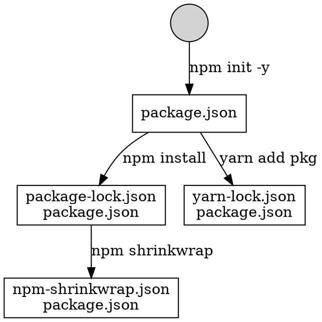
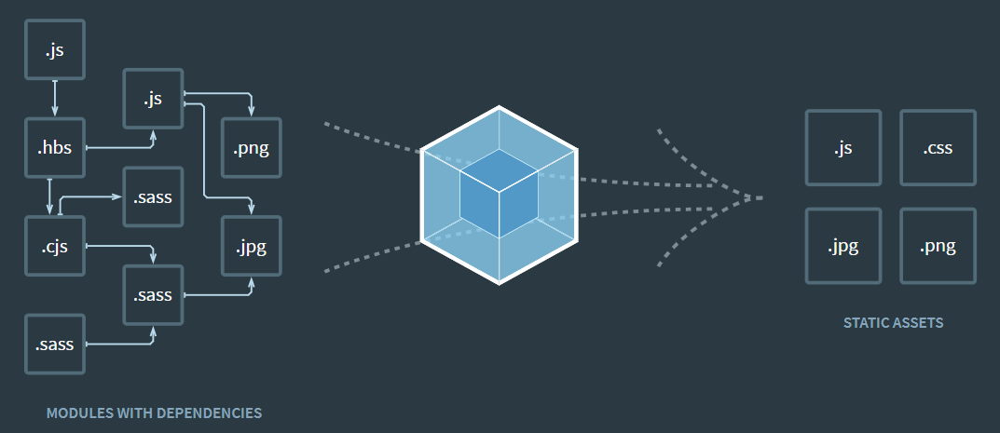

# Node.js

> Node.js is an open-source, cross-platform JavaScript run-time environment that executes JavaScript code outside of a browser. 

<!-- vertical -->

## Package Manager

### npm

* [npm | build amazing things](https://www.npmjs.com/ "")
  - Install with correct access level
* [Yarn](https://yarnpkg.com/zh-Hant/ "")
  - Recommended

<!-- vertical -->


Note:


<!-- vertical -->

### package.json

* **name**: mandatory
* **version**: `MajorVersion.MinorVersion.Patch`
* **main**: mandatory, relative path to package directory
* **scripts**: customize command, `npm run <script>`
* **dependencies**: necessary for running code
  - `npm install --save <pkg>`
* **devDependencies**: necessary for running DEV tools (babel transpile, webpack toolchain, lint, test)
  - `npm install --save-dev <pkg>`
* **engines**: Node version requirement

<!-- vertical -->

TODO: Difference between run in command line and run script in `package.json`?

<!-- vertical -->

scripts `pre-` and `post-` hook

```js
"scripts": {
    "test": "mocha test/",
    "pretest": "echo test start!",
    "posttest": "echo test end!"
}
```

<!-- vertical -->

### npx (Node Package Executor ??)

[npx  -  npm](https://www.npmjs.com/package/npx "")

[Introducing npx: an npm package runner – Kat Marchán – Medium](https://medium.com/@maybekatz/introducing-npx-an-npm-package-runner-55f7d4bd282b "")

[javascript - Difference between npx and npm? - Stack Overflow](https://stackoverflow.com/questions/50605219/difference-between-npx-and-npm "")

<!-- vertical -->

## [Babel](https://babeljs.io/ "")

A transpiler that converts ES6 code to ES5 code.


```shell
$ npm install --save-dev babel-preset-react
$ npm install --save-dev babel-preset-es2015
$ npm install --save-dev babel-preset-stage-0
```

Note:

[Babel · Online REPL](https://babeljs.io/repl "")

[Plugins · Babel](https://babeljs.io/docs/en/plugins/ "")

[babel-preset - npm search](https://www.npmjs.com/search?q=babel-preset "")

<!-- vertical -->

`.babelrc`
```javascript
{
  "presets": [
    "es2015",
    "react",
    "stage-0"
  ],
  "plugins": []
}
```
<!-- vertical -->

`babel-cli` package provides:
1.  `babel` command to transpile js file
2. `babel-node` to run js file directly

```shell
$ npm install --global babel-cli

$ babel example.js --out-file compiled.js
$ node compiled.js

$ babel-node --presets babel-preset-es2015 example.js
```
<!-- vertical -->

### babel-polyfill

> A polyfill is a piece of code (usually JavaScript on the Web) used to provide modern functionality on older browsers that do not natively support it.

Support new API:

Iterator, Generator, Set, Maps, Proxy, Reflect, Symbol, Promise, Object.assign

[@babel/polyfill · Babel](https://babeljs.io/docs/en/babel-polyfill "")

```javascript
import 'babel-polyfill'
// or
require('babel-polyfill')
```

Note: [Polyfill - MDN Web Docs Glossary: Definitions of Web-related terms | MDN](https://developer.mozilla.org/en-US/docs/Glossary/Polyfill "")

<!-- vertical -->

## Webpack



<!-- vertical -->

### Concepts

1. Entry

```js
module.exports = {
  entry: {
    app: './src/app.js',   // entry 1
    adminApp: './src/adminApp.js'  // entry 2
  }
};
```

<!-- vertical -->

2. Output

there can be multiple `entry` points, only one `output` configuration is specified.

```js
module.exports = {
  entry: {
    app: './src/app.js',
    search: './src/search.js'
  },
  output: {
    filename: '[name].js',     // output file name
    publicPath: '/dist/',      // web access path
    path: __dirname + '/dist'  // absolute path of bundled output file
  }
};
```

```js
module.exports = {
  //...
  output: {
    path: '/home/proj/cdn/assets/[hash]',
    publicPath: 'https://cdn.example.com/assets/[hash]/'
  }
};
```

<!-- vertical -->

3. Plugin

<!-- vertical -->

4. Module


<!-- vertical -->

### CSS processing

1. sass-loader
2. postcss-loader
3. css-loader
4. style-loader

TODO add webpack css loader configuration

<!-- vertical -->

### Common plugins

TODO ExtractTextPlugin("bundle.css")

DefinePlugin

HtmlWebpackPlugin


<!-- vertical -->

### [Hot Module Replacement](https://webpack.js.org/concepts/hot-module-replacement "")

> Hot Module Replacement (HMR) exchanges, adds, or removes modules while an application is running, without a full reload.


Note:

[A Minimal Example of HMR in a Redux Application | Toptal](https://www.toptal.com/javascript/hot-module-replacement-in-redux "")

[Understanding Webpack HMR](https://www.javascriptstuff.com/understanding-hmr/ "")

[webpack与browser-sync热更新原理深度讲解 | louis blog](https://louiszhai.github.io/2017/04/19/hmr/ "")

<!-- vertical -->

## ESLint

`eslint --init`
