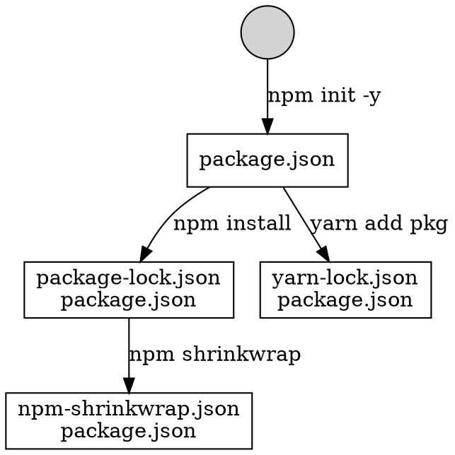

# Node.js

> Node.js is an open-source, cross-platform JavaScript run-time envirronment that executes JavaScript code outside of a browser. 

Note: 

[The Javascript Runtime Environment - Jamie Uttariello - Medium](https://medium.com/@olinations/the-javascript-runtime-environment-d58fa2e60dd0 "")

[How JavaScript works: an overview of the engine, the runtime, and the call stack](https://blog.sessionstack.com/how-does-javascript-actually-work-part-1-b0bacc073cf "")

<!-- vertical -->

## Package Manager

### npm

* [npm | build amazing things](https://www.npmjs.com/ "")
  - Install with correct access level
* [Yarn](https://yarnpkg.com/zh-Hant/ "")
  - Recommended

<!-- vertical -->


Note:



TODO: Difference between run in command line and run script in `package.json`?

<!-- vertical -->

### package.json

* **name**: mandatory
* **version**: `MajorVersion.MinorVersion.Patch`
* **main**: mandatory, relative path to package directory
* **scripts**: customize command, `npm run <script>`
* **dependencies**: necessary for running production code
  - `npm install --save <pkg>`
* **devDependencies**: necessary for running DEV tools (babel transpile, webpack toolchain, lint, test)
  - `npm install --save-dev <pkg>`

<!-- vertical -->

## [Babel](https://babeljs.io/ "")

A transpiler that converts ES6 code to ES5 code.


```shell
$ npm install --save-dev babel-preset-react
$ npm install --save-dev babel-preset-es2015
$ npm install --save-dev babel-preset-stage-0
```

Note:

[Babel · Online REPL](https://babeljs.io/repl "")

[Plugins · Babel](https://babeljs.io/docs/en/plugins/ "")

[babel-preset - npm search](https://www.npmjs.com/search?q=babel-preset "")

<!-- vertical -->

`.babelrc`
```javascript
{
  "presets": [
    "es2015",
    "react",
    "stage-0"
  ],
  "plugins": []
}
```
<!-- vertical -->

`babel-cli` package provides:
1.  `babel` command to transpile js file
2. `babel-node` to run js file directly

```shell
$ npm install --global babel-cli

$ babel example.js --out-file compiled.js
$ node compiled.js

$ babel-node --presets babel-preset-es2015 example.js
```
<!-- vertical -->

### babel-polyfill

> A polyfill is a piece of code (usually JavaScript on the Web) used to provide modern functionality on older browsers that do not natively support it.

Support new API:

Iterator, Generator, Set, Maps, Proxy, Reflect, Symbol, Promise, Object.assign

[@babel/polyfill · Babel](https://babeljs.io/docs/en/babel-polyfill "")

```javascript
import 'babel-polyfill'
// or
require('babel-polyfill')
```

Note: [Polyfill - MDN Web Docs Glossary: Definitions of Web-related terms | MDN](https://developer.mozilla.org/en-US/docs/Glossary/Polyfill "")

<!-- vertical -->

## Webpack


<!-- vertical -->

### Concepts

1. Entry

```js
module.exports = {
  entry: {
    app: './src/app.js',   // entry 1
    adminApp: './src/adminApp.js'  // entry 2
  }
};
```

<!-- vertical -->

2. Output

* There can be multiple `entry` points, only one `output` configuration is specified.
* Output file name can be dynamic
  - Check in compiled output file is inconvenient
  - Include output file dynamicly in HTML page

```js
module.exports = {
  entry: {
    app: './src/app.js',
    search: './src/search.js'
  },
  output: {
    filename: '[name].js',     // output file name
    publicPath: '/dist/',      // web access path
    path: __dirname + '/dist'  // absolute path of bundled output file
  }
};
```

<!-- vertical -->

* Use file content hash as output file name
* Every time file content changed, user will download newly compiled script

```js
module.exports = {
  //...
  output: {
    path: '/home/proj/cdn/assets/[hash]',
    publicPath: 'https://cdn.example.com/assets/[hash]/'
  }
};
```

<!-- vertical -->

3. Loaders

> Loaders allow webpack to process other types of files and convert them into valid modules that can be consumed by your application and added to the dependency graph.

1. The `test` property identifies which file or files should be transformed by regular expression
2. The `use` property indicates which loader should be used to do the transforming

<!-- vertical -->

```javascript
module.exports = {
  output: {
    filename: 'my-first-webpack.bundle.js'
  },
  module: {
    rules: [
      {
        test: /\.(js|jsx)$/,
        exclude: /node_modules/,
        use: {
          loader: "babel-loader"
        }
      },
      {
        test: /\.html$/,
        use: [
          {
            loader: "html-loader",
            options: { minimize: true }
          }
        ]
      }
    ]
  }
};
```

<!-- vertical -->

4. Plugin

> Plugins can be leveraged to perform a wider range of tasks like bundle optimization, asset management and injection of environment variables.


```javascript
const HtmlWebpackPlugin = require('html-webpack-plugin'); //installed via npm
const webpack = require('webpack'); //to access built-in plugins

module.exports = {
  module: {
    rules: [
      { test: /\.txt$/, use: 'raw-loader' }
    ]
  },
  plugins: [
    new HtmlWebpackPlugin({template: './src/index.html'})
  ]
};
```

<!-- vertical -->

5. Dependency Graph

> Starting from these **entry points**, webpack recursively builds a dependency graph that includes every module your application needs, then bundles all of those modules into a small number of bundles - often, just one - to be loaded by the browser.

<!-- vertical -->

### CSS processing

1. sass-loader
2. postcss-loader
3. css-loader
4. style-loader

```shell
$ npm install style-loader css-loader --save-dev
```

```javascript
// webpack.config.js
module.exports = {
	...
    module: {
        rules: [{
            test: /\.scss$/,
            use: [
                "style-loader", // creates style nodes from JS strings
                "css-loader", // translates CSS into CommonJS
                "sass-loader" // compiles Sass to CSS, using Node Sass by default
            ]
        }]
    }
};
```

Note: [webpack-contrib/sass-loader: Compiles Sass to CSS](https://github.com/webpack-contrib/sass-loader "")

### Common plugins

ExtractTextPlugin("bundle.css")

DefinePlugin

HtmlWebpackPlugin

<!-- vertical -->

### [Hot Module Replacement](https://webpack.js.org/concepts/hot-module-replacement "")

> Hot Module Replacement (HMR) exchanges, adds, or removes modules while an application is running, without a full refresh.

<!-- vertical -->


Note:


[Understanding Webpack HMR](https://www.javascriptstuff.com/understanding-hmr/ "")

[A Minimal Example of HMR in a Redux Application | Toptal](https://www.toptal.com/javascript/hot-module-replacement-in-redux "")

[webpack与browser-sync热更新原理深度讲解 | louis blog](https://louiszhai.github.io/2017/04/19/hmr/ "")
