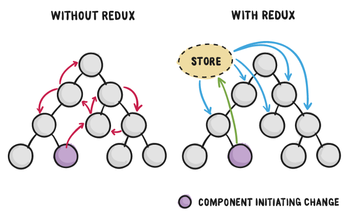

# React & Redux

<!-- vertical -->

## React

* Declarative programming, DOM operations are encapsulated
* Component oriented, JavaScript (JSX) + CSS
* Virtual DOM, render to Web or native app

<!-- vertical -->

## VirtualDOM


Note:

TODO: add VDOM and Real DOM image

[The Inner Workings Of Virtual DOM – rajaraodv – Medium](https://medium.com/@rajaraodv/the-inner-workings-of-virtual-dom-666ee7ad47cf "")
[How Virtual-DOM and diffing works in React – Gethyl George Kurian – Medium](https://medium.com/@gethylgeorge/how-virtual-dom-and-diffing-works-in-react-6fc805f9f84e "")
[Virtual DOM: How inefficiency can lead to better performance - AFAS Dev](https://dev.afas.nl/blog-dev/virtual-dom-how-inefficiency-can-lead-to-better-performance "")
[Understanding the Virtual DOM](https://bitsofco.de/understanding-the-virtual-dom/ "")
[The Real Benefits of the Virtual DOM in React.js](https://www.accelebrate.com/blog/the-real-benefits-of-the-virtual-dom-in-react-js/ "")

<!-- vertical -->

## JSX

> JSX, or JavaScript XML, is an extension to the JavaScript language syntax.

* If first-letter of tag is capitalized then User defined components otherwise HTML tag
* Attributes: `className` -> `class`; `onClick` -> `onclick`
* Add `import React from 'react';` wherever you use JSX

<!-- vertical -->

```jsx
import React from 'react';

class ClickCounter extends Component {

  constructor(props) {
    super(props);
    this.onClickButton = this.onClickButton.bind(this);
    this.state = { count: 0 };
  }

  onClickButton() {
    this.setState({count: this.state.count + 1});
  }

  render() {
    return (
      <div style={{margin: '16px'}}>
        <button onClick={this.onClickButton}>Click Me</button>
        <div>
          Click Count: <span id="clickCount">{this.state.count}</span>
        </div>
      </div>
    );
  }
}
```

<!-- vertical -->

## `props` and `state`

<!-- vertical -->

### `props`

Declaration:

```jsx
<User name="yan" age="30"></User>
```

Read:

```jsx
class User extends Component {
    render() {
        // this.props.age = "18"; // TypeError
        return <div>{this.props.name}</div>
    }
}
```

Write: `TypeError: Cannot assign to read only property`

<!-- vertical -->

**Functional Component**

```jsx
function User(props) {
	render() {
		// return <div>{props.name}</div> // better wrapped with ()
		return (
			<div>{props.name}</div>
		);
	}
}
```

* Component that do not need its own state
* Read `props` insteaf of `this.props`
* It's recommended to use `()` after `return` to avoid Automatic Semicolon Insertion

Note: [Understanding Automatic Semicolon Insertion in JavaScript](http://www.bradoncode.com/blog/2015/08/26/javascript-semi-colon-insertion/ "")

<!-- vertical -->

`props.children` : [Try Me](https://codepen.io/gaearon/pen/ozqNOV?editors=0010 )

```jsx
function FancyBorder(props) {
  return (
    <div className={'FancyBorder FancyBorder-' + props.color}>
      {props.children}
    </div>
  );
}

function WelcomeDialog() {
  return (
    <FancyBorder color="blue">
      <h1 className="Dialog-title">
        Welcome
      </h1>
      <p className="Dialog-message">
        Thank you for visiting our spacecraft!
      </p>
    </FancyBorder>
  );
}
```

Note: [Composition vs Inheritance – React](https://reactjs.org/docs/composition-vs-inheritance.html "")

<!-- vertical -->

**PropTypes**

```js
import PropTypes from 'prop-types';
// import {PropTypes} from 'react'; // before react 15.5

MyComponent.propTypes = {
  // You can declare that a prop is a specific JS type. By default, these
  // are all optional.
  optionalFunc: PropTypes.func,
  optionalNumber: PropTypes.number,
  optionalString: PropTypes.string,

  // You can ensure that your prop is limited to specific values by treating
  // it as an enum.
  optionalEnum: PropTypes.oneOf(['News', 'Photos']),

  // An object that could be one of many types
  optionalUnion: PropTypes.oneOfType([
    PropTypes.string,
    PropTypes.number,
    PropTypes.instanceOf(Message)
  ])
};
```

<!-- vertical -->

Props type check only works in development mode, ignored in production


<!-- vertical -->


### `state`

Declaration:

```jsx
	constructor(props) {
		super(props);
		this.state = {
			time: 0
		}
	}
```

Read: `this.state.time`

<!-- vertical -->

Write:

1. ~~`this.state.variable = newVar`~~
  * only sets value and can't trigger re-render, do not use

2. `this.setState(newState[, callback])` 
  * change `this.state` and invoke re-render
  * React will combine multiple `setState()`  into one change and then run callback
  * Asynchronous call: append operation to current event loop

<!-- vertical -->

```jsx
class AsyncSetState extends React.Component {
	constructor(props) {
		super(props);
		this.state = { time: 0 };
		console.log('init ' + this.state.time); // 0
	}
	
	componentDidMount() {
		this.setState({time: this.state.time + 1}, () => {
			console.log('callback ' + this.state.time); // return 1 after setState
		});
		console.log('subsequence ' + this.state.time); // return 0 instead of 1
	}
	
	render() {
		console.log('render ' + this.state.time); // 1st time 0, 2nd time 1
		return <div>this.state.time: {this.state.time}</div>
	}
}
```

<!-- vertical -->

###  `props` versus `state`

| Comparison     | `props`                      | `state`                         |
| ------------   | ---------------------------- | ------------------------------- |
| Usage          | data from parent to children | inner state of a component      |
| Modification   | immutable                    | call `setState()`               |
| Initialization |  `getDefaultProps()`         | `getInitialState()`             |

<!-- vertical -->

## context

> Context provides a way to share values like these between components without having to explicitly pass a prop through every level of the tree.

* From ancestor to descendant component
* It's better to user `context` for app level state, such as `Provider` provides `store`

Note: [Context – React](https://reactjs.org/docs/context.html "")

[Passing Data Between React Components — Parent, Children, Siblings](https://towardsdatascience.com/passing-data-between-react-components-parent-children-siblings-a64f89e24ecf "")

<!-- vertical -->

```js
import PropTypes from 'prop-types';

class Ancestor extends React.Component {
	static childContextTypes = {
		text: PropTypes.string
	};

	getChildContext() {
		return { text: 'This is ancestor' };
	};

	render() {
		return (
			<span>{"ANCESTOR -> "}{this.props.children}</span>
		);
	};
};
```

<!-- vertical -->

```javascript
class Child extends React.Component {

	static contextTypes = {
		text: PropTypes.string
	};

	render() {
		return (<div>{"CHILD -> " + this.context.text}</div>);
	};
}
```
<!-- vertical -->

## From child to parent

* pass callback function to child
* use `ref` to read child status or DOM

<!-- vertical -->

### callback

```javascript
class Parent extends React.Component {
  state = { message: "" }

  callbackFunction = (childData) => {
    this.setState({ message: childData })
  }

  render() {
    return (
      <div>
        <Child parentCallback={this.callbackFunction} />
        <p> {this.state.message} </p>
      </div>
    );
  }
}
```
<!-- vertical -->

```javascript
class Child extends React.Component {
  sendData = () => {
    this.props.parentCallback("Hey dude, How’s it going?");
  }
  
  render() {
    // you can call function sendData whenever you'd like
    //  to send data from child component to Parent component.
  }
};
```

* Invasive to child component
* No way if callback is not exposed or not even exists

<!-- vertical -->


### `ref`

* get child component actual DOM reference after `componentDidMount()` and `componentDidUpdate()`
* Define ref:
	- `<Child ref="nameInput"/>`
	- `<Child ref={(input) => this.nameInput = input} />`
* Using ref is generally not recommended, especially for modifying DOM or inner state

<!-- vertical -->

```js
class SimpleRef extends React.Component {
	constructor(props) {
		super(props);
		setTimeout(() => {
			console.log(this.nameInput.value);
			this.nameInput.focus(); // focus on text input
			window.inputDOM = ReactDOM.findDOMNode(this.nameInput);
			// try window.inputDOM.value = 'any'
		}, 8000); // read input text after 8s
	}

	render() {
		// ref callback will be triggered after 
		// componentDidMount and componentDidUpdate
		return (
			<input ref={(input) => this.nameInput = input} type="text" />
		);
	}
}
```

Note: [Refs and the DOM – React](https://reactjs.org/docs/refs-and-the-dom.html "")

<!-- vertical -->

## High Order Component

```jsx
import {React} from React;

function hoc(Comp) {
    return class EnhancedComponent extends React.Component {
        extendFunc() {
            // enhance component behavior
        }

        render() {
            return (
                <Comp {...this.props} />
            )
        }
    }
}
const newComp = hoc(aComp);
```

Note:

```jsx
function transProps(transFunc) {
    return function(Comp) {
        return class extends Component {
            render() {
                return <Comp {...transFunc(this.props)} />
            }
        }
    }
}
const newAdapter = transProps(transPropsFunc)(aComp);
```

<!-- vertical -->

## Component Life Cycle

* Mounting -> Updating -> Unmounting
* Mounting and Unmounting will only run once
* Hook functions provided by React

<!-- vertical -->


Note:
[React lifecycle methods diagram](http://projects.wojtekmaj.pl/react-lifecycle-methods-diagram/ "")

<!-- vertical -->


<!-- vertical -->

Mounting

* `constructor()`
  - set initial value for state
* `componentWillMount()`
* `render()`
  - should be pure function
  - draw UI with initial state
* `componentDidMount()`
  - usually dispatch load data action

<!-- vertical -->

Updating - When will a component redraw?

1. Parent `props` update
   * `componentWillReceiveProps(nextProps)`
   * `shouldComponentUpdate(nextProps, nextState)`
   * `componentWillUpdate(nextProps, nextState)`
   * `render()`
   * `componentDidUpdate(prevProps, prevState)`
<!-- vertical -->
2. Own `state` change
   * `shouldComponentUpdate(nextProps, nextState)`
   * `componentWillUpdate(nextProps, nextState)`
   * `render()`
   * `componentDidUpdate(prevProps, prevState)`
<!-- vertical -->
3. `this.forceUpdate()`
   * `componentWillUpdate(nextProps, nextState)`
   * `render()`
   * `componentDidUpdate(prevProps, prevState)`
<!-- vertical -->

* `componentWillReceiveProps(nextProps)`
  - usually sync `props` change to component `state`
  - unsafe in React 16
* `shouldComponentUpdate(nextProps, nextState)`
  - currProps -> `this.props`, currState -> `this.state`
  - need to re-render given new props and state ? return `true` by default implementation
  - reduce unnecessary `render()` to improve performance
<!-- vertical -->
* `componentWillUpdate(nextProps, nextState)`
  - perform preparation before an update occurs. 
  - unsafe in React 16
* `componentDidUpdate(prevProps, prevState)`
  - invoked immediately after updating occurs
  - `setState()` here may cause infinite loop, be very careful

Note:


<!-- vertical -->
Unmounting

* `componentWillUnmount()`
  - usually corresponding to `componentDidMount()`
  - should release resource: clear timer, remove event listener
  - will be called if be parent component re-render

<!-- vertical -->

```js
class WindowWidth extends React.Component {
	constructor(props) {
		super(props);
		this.state = { windowWidth: window.innerWidth };
		// manually bind this
		this.onWindowResize = this.onWindowResize.bind(this);
	}

	onWindowResize(event) {
		this.setState({ windowWidth: window.innerWidth });
	}

	componentDidMount() {
		window.addEventListener('resize', this.onWindowResize);
	}
	componentWillUnmount() {
		window.removeEventListener('resize', this.onWindowResize);
		// should have exactly same params as addEventListener!
	}

	render() {
		return (<div>Window width: {this.state.windowWidth} </div>);
	}
}
```

<!-- vertical -->


Note:
[Get and debug event listeners &nbsp;|&nbsp; Web      &nbsp;|&nbsp; Google Developers](https://developers.google.com/web/updates/2015/05/get-and-debug-event-listeners "")

[javascript - When does a component unmount? - Stack Overflow](https://stackoverflow.com/questions/41498756/when-does-a-component-unmount "")

TODO: when will datagrid be unmounted ?

<!-- vertical -->

# Redux

<!-- vertical -->



<!-- vertical -->

## Flux

* Intended to be used in companion with React
* Similar to traditional MVC pattern
  - React as View
  - Store as Model
  - Action + Dispatcher as Controller

<!-- vertical -->


Note:

[Flux vs MVC Design Pattern - Madasamy M - Medium](https://medium.com/@madasamy/flux-vs-mvc-design-pattern-de134dfaa12b "")

<!-- vertical -->

### Redux VS Flux

* Created by Dan Abramov
* `Redux = reducer + Flux`
* More strict to control data flow than Flux
  - Single source of truth
  - Dispatcher got simplified to `store.dispatch()`
  - State is read-only (dispatch actions instead of mutating state directly)
  - Changes are made with pure functions (`reducer`)

Note: 

[What Does Redux Do? (and when should you use it?)](https://daveceddia.com/what-does-redux-do/ "") ✔✔✔✔

[How Redux Works: A Counter-Example ](https://daveceddia.com/how-does-redux-work/ "") ✔✔✔✔

[Getting Started with Redux · Redux](https://redux.js.org/introduction/getting-started "")

TODO: [Understanding Redux: The World’s Easiest Guide to Beginning Redux](https://www.freecodecamp.org/news/understanding-redux-the-worlds-easiest-guide-to-beginning-redux-c695f45546f6/ "")

[Redux中文文档 · GitBook](http://cn.redux.js.org/index.html "")

<!-- vertical -->


Note:


<!-- vertical -->


<!-- vertical -->

### State Tree

A simple TODO app state tree, [Try Me](https://codesandbox.io/s/github/reduxjs/redux/tree/master/examples/todos "")

```javascript
{
  todos: // todo records added by user
    [
      {
        text: 'Eat food',
        completed: true
      }, {
        text: 'Exercise',
        completed: false
      }
    ],
  visibilityFilter: 'SHOW_COMPLETED'
  // only show completed records on screen
}
```

Note: [Examples · Redux](https://redux.js.org/introduction/examples "")

<!-- vertical -->

### Action

> An action is a plain JavaScript object that describes in a minimal way what needs to get updated in the application state.

* Action is similar to browser event
* **type**: string identifier to distinct different actions
* **payload**: necessary data to be shipped with action


<!-- vertical -->

A TODO app actions
```javascript
{ type: 'ADD_TODO', text: 'Go to swimming pool' }
{ type: 'TOGGLE_TODO', index: 1 }
{ type: 'SET_VISIBILITY_FILTER', filter: 'SHOW_ALL' }
```

<!-- vertical -->

Action creator: a function that returns an action

```javascript
function addTodo(text) {
  return {
    type: 'ADD_TODO',
    text
  }
}
```

<!-- vertical -->

### Reducer

> Reducers are **pure functions** which describe state mutations. Unlike actions, reducers do know how to have things changed in the application state, they do know the implementation details for those changes.

* `reducer = (prevState, action) => nextState`
* It's called a reducer because it's the type of function you would pass to `Array.prototype.reduce(reducer, initialValue)`

<!-- vertical -->

Why call it reducer ?

```javascript
const countReducer = function (state, action) {
    if (action.type == 'INCREMENT') {
        return state + 1;
    } else if (action.type == 'DECREMENT') {
        return state - 1;
    } else {
        return state;
    }
}

// an array of actions
const actions =
  [ { type: 'INCREMENT' }
  , { type: 'INCREMENT' }
  , { type: 'INCREMENT' }
  , { type: 'INCREMENT' }
  , { type: 'DECREMENT' }
  ]

// initial state
const initState = 0
  
console.log(actions.reduce(countReducer, initState))
// 3 (final state)
// (INCREMENT 4 times, DECREMENT 1 time)
```

Note: 

[javascript - Why is a Redux reducer called a reducer? - Stack Overflow](https://stackoverflow.com/questions/40599496/why-is-a-redux-reducer-called-a-reducer "")

<!-- vertical -->

Root Reducers

```javascript
const initialState = {
  todos: [],
  visibilityFilter: 'SHOW_ALL'
};
function todoApp(state = initialState, action) {
  return {
    // todos is key name and corresponding reducer function name
    todos: todos(state.todos, action),
    visibilityFilter: visibilityFilter(state.visibilityFilter, action)
  }
}
```
* A combined reducer of `todos` and `visibilityFilter`
* `todos` and `visibilityFilter` are both state key and reducer for corresponding key

<!-- vertical -->

Split Root Reducer

```javascript
// !! Here we pass in store.getState().todos, not store.getState()
function todos(state = [], action) {
  switch (action.type) {
    case 'ADD_TODO': // add new todo item, default not completed
      return state.concat([{ text: action.text, completed: false }])
    case 'TOGGLE_TODO': // reverse item completed status
      return state.map((todo, index) =>
        action.index === index
          ? { text: todo.text, completed: !todo.completed }
          : todo
      )
    default:
      return state
  }
}
```

<!-- vertical -->

```javascript
// !! Here we pass in store.getState().visibilityFilter, not store.getState()
function visibilityFilter(state = 'SHOW_ALL', action) {
  if (action.type === 'SET_VISIBILITY_FILTER') {
    return action.filter
  } else {
    return state
  }
}
```

<!-- vertical -->


```javascript
// equivalent to naive combined reducer
import { combineReducers } from 'redux';

const todoAppReducer = combineReducers({
  todos,
  visibilityFilter
});

export default todoAppReducer;
```

<!-- vertical -->
A simplified verison of `combineReducers()`

```javascript
export default function combineReducers(reducers) {
  // ... omitted many checks
  const reducerKeys = Object.keys(reducers)

  return function combination(state = {}, action) {
    let hasChanged = false
    const nextState = {}
    for (let i = 0; i < reducerKeys.length; i++) { // all sub-reducers
      const key = reducerKeys[i]
      const reducer = reducers[key]
      const previousStateForKey = state[key]
      const nextStateForKey = reducer(previousStateForKey, action)
      nextState[key] = nextStateForKey
      // new state object means state changed
      hasChanged = hasChanged || nextStateForKey !== previousStateForKey
    }
    return hasChanged ? nextState : state
  }
}
```
<!-- vertical -->

* Action need to pass all sub reducers
* You have to provide `default: return state` in every sub reducer


<!-- vertical -->


Note: [Common Redux misconception](https://twitter.com/dan_abramov/status/688087202312491008 )

Not Very Good Example: [Learn-Redux/comments.js at fe1cfae5b2ba5bd7ab23b289cad7b9a6f03c0bd9 · wesbos/Learn-Redux](https://github.com/wesbos/Learn-Redux/blob/fe1cfae5b2ba5bd7ab23b289cad7b9a6f03c0bd9/client/reducers/comments.js "")

Good Example: [Learn-Redux/comments.js at 6ab9f054c289d1bcddbcc79e7429670e0489aaaa · wesbos/Learn-Redux](https://github.com/wesbos/Learn-Redux/blob/6ab9f054c289d1bcddbcc79e7429670e0489aaaa/client/reducers/comments.js "")

<!-- vertical -->

### Store

* Maintain global state tree
  - `store.getState()`
  - `store.dispatch(action)`
  - `store.subscribe(listener)`
    * `listener` is callback function
    * returns a unsubscribe function

```js
const listener = () => {
  console.log('state changed, do something', store.getState());
}
const unsubscribe = store.subscribe(listener);
unsubscribe();
```

<!-- vertical -->

A simplified verison of  `createStore()`
```js
function createStore(reducer) {
  let state;
  let listeners = [];  // registered listeners (call back function array)
  
  const getState = () => state;
  
  const dispatch = (action) => {
    state = reducer(state, action);  // reducer change state
    listeners.forEach(listener => listener()); // notify all listener
  };
  
  const subscribe = (listener) => {
    listeners.push(listener);
    return () => { // return all listener except listener passed in
      listeners = listeners.filter(l => l !== listener);
    };
  };
  
  dispatch({ type: '@@redux/INIT' }); // system action by Redux itself
  
  return { getState, dispatch, subscribe };
};
```
<!-- vertical -->

`const store = createStore(reducer[, initialState[, enchancer]]);`

```js
import { createStore } from 'redux';

function todos(state = [], action) {
  switch (action.type) {
    case 'ADD_TODO':
      return state.concat([action.text]);
    default:
      return state;
  }
}

const store = createStore(todos, ['Use Redux']);

store.dispatch({
  type: 'ADD_TODO',
  text: 'Read the docs'
});

console.log(store.getState());
// [ 'Use Redux', 'Read the docs' ]
```

Note: [createStore · Redux](https://redux.js.org/api/createstore "")

<!-- vertical -->

* `redux` package gives you a store, and lets you keep state in it, and get state out, and respond when the state changes
* `react-redux` package lets you connect pieces of the state to React components
  - `<Provider store={store}/>` providers a container with store as context for child components
  - `connect` higher-order component

Note:

* [fknussel/redux-from-scratch: Implementing redux, react-redux and redux-thunk from scratch](https://github.com/fknussel/redux-from-scratch?source=post_page--------------------------- "")
* [    Leveling Up with React: Redux | CSS-Tricks  ](https://css-tricks.com/learning-react-redux/?source=post_page--------------------------- "")
* [Redux Tutorial by Dan Abramov on egghead.io](https://egghead.io/courses/getting-started-with-redux?source=post_page--------------------------- "")
* [Understanding Redux Middleware - Mark - Medium](https://medium.com/@meagle/understanding-87566abcfb7a "")
* [Understanding Redux + React in Easiest Way Part-1 - Javascript Developers - Medium](https://medium.com/tkssharma/understanding-redux-react-in-easiest-way-part-1-81f3209fc0e5 "")
* [Redux for React: A Simple Introduction - Ross Bulat - Medium](https://medium.com/@rossbulat/redux-for-react-a-simple-introduction-b1f9dcbda8f4 "")
<!-- vertical -->

A simplified verison of `Provider`

```javascript
export class Provider extends React.Component {
  getChildContext() {
    return {
      store: this.props.store
    };
  }

  render() {
    return this.props.children;
  }
}

Provider.childContextTypes = {
  store: React.PropTypes.object.isRequired
};
```

<!-- vertical -->

> The purpose of `connect` is to return a container component which is connected to the store: it injects part of the Redux state and also actions into our components as props, and it’s also part of the react-redux library.

<!-- vertical -->

|                | Presentational Components        | Container Components                           |
| -------------: | :------------------------------- | ---------------------------------------------- |
|        Purpose | How things look (markup, styles) | How things work (data fetching, state updates) |
| Aware of Redux | No                               | Yes                                            |
|   To read data | Read data from props             | Subscribe to Redux state                       |
| To change data | Invoke callbacks from props      | Dispatch Redux actions                         |
|    Are written | By hand                          | Usually generated by React Redux               |

<!-- vertical -->

A simplified verison of `connect()`

```javascript
export function connect(mapStateToProps, mapDispatchToProps) {
  return function (WrappedComponent) {
    class ConnectedWrappedComponent extends React.Component {
      componentDidMount = () => {
        const {subscribe} = this.context.store;
        this.unsubscribe = subscribe(this.handleChange.bind(this));
      }
      componentWillUnmount = () => { this.unsubscribe(); }
      handleChange = () => { this.forceUpdate(); }

      render() {
        const {getState, dispatch} = this.context.store;
        return (
          <WrappedComponent
            {...this.props}
            {...mapStateToProps(getState(), this.props)}
            {...mapDispatchToProps(dispatch, this.props)} />
        );
      }
    }

    ConnectedWrappedComponent.contextTypes = {
      store: React.PropTypes.object.isRequired
    };

    return ConnectedWrappedComponent;
  };
}
```

<!-- vertical -->

> `connect` returns a container component whose props will be the result of merging the objects returned from `mapStateToProps(state[, ownProps])` and `mapDispatchToProps(dispatch[, ownProps])` together with its own props.

```javascript
function mapStateToProps(state) {
  return {
    count: state.counter // this.props.count
  };
}
function mapDispatchToProps(dispatch) {
  return {
    increment: dispatch({ type: 'INCREMENT' }), // this.props.increment()
    decrement: dispatch({ type: 'DECREMENT' })  // this.props.decrement()
  };
}
export connect(mapStateToProps, mapDispatchToProps)(Counter);
```

<!-- vertical -->

Built-in `bindActionCreators()`

```javascript
// action creators
export const increment = () => ({
  type: 'COUNTER/INCREMENT'
});
export const decrement = () => ({
  type: 'COUNTER/DECREMENT'
});


function mapDispatchToProps(dispatch) {
  return {
    increment: () => dispatch(increment()),
    decrement: () => dispatch(decrement())
  };
};

// equivalant to
import { bindActionCreators } from 'redux'
const boundActionCreators = bindActionCreators({increment, decrement}, dispatch)
```

Note: [bindActionCreators · Redux](https://redux.js.org/api/bindactioncreators "")

Action creators are nothing other than functions returning an object.

<!-- vertical -->

A simplified version of `bindActionCreator()`

```js
function bindActionCreator(actionCreator, dispatch) {
  return (...args) => dispatch(actionCreator(...args))
}

export default function bindActionCreators(actionCreators, dispatch) {
  if (typeof actionCreators === 'function') {
    return bindActionCreator(actionCreators, dispatch)
  }

  const keys = Object.keys(actionCreators)
  const boundActionCreators = {}
  for (let i = 0; i < keys.length; i++) {
    const key = keys[i]
    const actionCreator = actionCreators[key]
    if (typeof actionCreator === 'function') {
      boundActionCreators[key] = bindActionCreator(actionCreator, dispatch)
    }
  }
  return boundActionCreators
}
```

<!-- vertical -->


<!-- vertical -->

### Middleware

* Action is plain obejct, reducer has no side effect
* When should we request data from remote server?

<!-- vertical -->


<!-- vertical -->


Middleware `compose()`

```javascript
// node_modules/redux/src/compose.js

/**
 * Composes single-argument functions from right to left. The rightmost
 * function can take multiple arguments as it provides the signature for
 * the resulting composite function.
 *
 * @param {...Function} funcs The functions to compose.
 * @returns {Function} A function obtained by composing the argument functions
 * from right to left. For example, compose(f, g, h) is identical to doing
 * (...args) => f(g(h(...args))).
 */
export default function compose(...funcs) {
	if (funcs.length === 0) {
		return arg => arg
	}

	if (funcs.length === 1) {
		return funcs[0]
	}
	// (f, g) -> f(g(...args)) -> 
	return funcs.reduce((a, b) => (...args) => a(b(...args)))
}
```

<!-- vertical -->

```javascript
const add1 = x => x + 1;
const addxy = (x, y) => x + y;
const mult2 = (x) => x * 2;
const square = x => x * x;
compose(square, add1, mult2, addxy)(1, 2);  // 49
compose(add1, mult2, square, addxy)(0, -1); // 3
```

<!-- vertical -->

StoreEnhancer `applyMiddleware()`

```javascript
// node_modules/redux/src/applyMiddleware.js
export default function applyMiddleware(...middlewares) {
  return createStore => (...args) => {
    const store = createStore(...args)
    let dispatch = () => {
      throw new Error(
        'Dispatching while constructing your middleware is not allowed. ' +
          'Other middleware would not be applied to this dispatch.'
      )
    }

    const middlewareAPI = {
      getState: store.getState,
      dispatch: (...args) => dispatch(...args)
    } // pass getState and dispatch to every middleware
    const chain = middlewares.map(middleware => middleware(middlewareAPI))
    dispatch = compose(...chain)(store.dispatch) // enhance store.dispatch

    return {
      ...store,
      dispatch
    }
  }
}
```

<!-- vertical -->

```js
/**
 * Logs all actions and states after they are dispatched.
 */
const logger = store => next => action => {
  // console.group(action.type)
  // console.info('dispatching', action)
  let result = next(action)
  // console.log('next state', store.getState())
  // console.groupEnd(action.type)
  return result
}

// enhanced createStore
let createStoreWithMiddleware = applyMiddleware(logger)(createStore)

let appRootReducer = combineReducers(reducers)
let store = createStoreWithMiddleware(appRootReducer)
```

Note:
[javascript - While debugging, can I have access to the Redux store from the browser console? - Stack Overflow](https://stackoverflow.com/questions/34373462/while-debugging-can-i-have-access-to-the-redux-store-from-the-browser-console "")


<!-- vertical -->

###  thunk

> A thunk is a function that wraps an expression to delay its evaluation.

```javascript
// calculation of 1 + 2 is immediate
// x === 3
let x = 1 + 2;

// calculation of 1 + 2 is delayed
// foo can be called later to perform the calculation
// foo is a thunk!
let foo = () => 1 + 2;
```

<!-- vertical -->

> Redux Thunk middleware allows you to write action creators that return a function instead of an action. The thunk can be used to delay the dispatch of an action, or to dispatch only if a certain condition is met. The inner function receives the store methods dispatch and getState as parameters.

Note:

[reduxjs/redux-thunk: Thunk middleware for Redux](https://github.com/reduxjs/redux-thunk "")

[淺談 Redux Thunk](https://www.slideshare.net/ssuserc4dc6d1/redux-thunk "")

[[ Part 3 ] First Async call, redux-thunk](http://dev.basharallabadi.com/2018/09/part-3-first-async-call-redux-thunk.html "")

[Quick Start · React Redux](https://react-redux.js.org/introduction/quick-start "")


[javascript - Fetch API request timeout? - Stack Overflow](https://stackoverflow.com/questions/46946380/fetch-api-request-timeout "")

<!-- vertical -->

An action creator that returns a function to perform **asynchronous dispatch**

```javascript
// plain action creator which returns object
function increment() {
  return {
    type: 'INCREMENT_COUNTER'
  };
}

// thunk action creator which returns function
function incrementAsync() {
  return dispatch => {
    setTimeout(() => {
      // Yay! Can invoke sync or async actions with `dispatch`
      dispatch(increment());
    }, 1000);
  };
}
```

<!-- vertical -->

An action creator that returns a function to perform **conditional dispatch**:

```javascript
function incrementIfOdd() {
  return (dispatch, getState) => {
    const { counter } = getState();

    if (counter % 2 === 0) {
      return; // action swallowed
    }

    dispatch(increment());
  };
}
```

<!-- vertical -->

`redux-thunk`

```javascript
import { createStore, applyMiddleware } from 'redux';
import thunk from 'redux-thunk';
import rootReducer from './reducers/index';

// Note: this API requires redux@>=3.1.0
const store = createStore(
  rootReducer,
  applyMiddleware(thunk) // store enhancer instead of initialState
);
```

<!-- vertical -->


<!-- vertical -->

```javascript
// redux-thunk
function createThunkMiddleware(extraArgument) {
  return ({ dispatch, getState }) => next => action => {
    if (typeof action === 'function') {
      return action(dispatch, getState, extraArgument);
    }

    return next(action);
  };
}

const thunk = createThunkMiddleware();
thunk.withExtraArgument = createThunkMiddleware;

export default thunk;
```

<!-- vertical -->

### `classnames`

```javascript
import classNames from 'classnames';

classNames('foo', { bar: true, duck: false}, 'baz': true); // "foo bar baz"
classNames('a', ['b', {c: true, d: false}]) // "a b c"
let btnType = 'primary';
classNames({ [`btn-${btnType}`]: true }); // "btn-primary"
```

<!-- vertical -->

### Integrate with jQuery

`npm install jquery --save`

```js
import $ from jquery;
var rootEle = this.refs.root;
// jQuery change ref node to modal message box
$(rootEle).modal({backdrop: 'static', keyboard: false, show: false});
// jQuery bind event
$(rootELe).on('hidden.bs.modal', this.handleHidden);
```

Note: 
[javascript - How to use JQuery with ReactJS - Stack Overflow](https://stackoverflow.com/questions/38518278/how-to-use-jquery-with-reactjs "")

<!-- vertical -->

## React Start Up

1. Local HTML Template
2. Online [CodePen](https://codepen.io/ ""), [CodeSandbox](https://codesandbox.io/ "")
3. `create-react-app`
  - Recommended

Note:
[Examples · Redux](https://redux.js.org/introduction/examples "")

<!-- vertical -->

### Local HTML Template

* [download this HTML template](https://raw.githubusercontent.com/reactjs/reactjs.org/master/static/html/single-file-example.html)
* handy for quick small testing, should not use in production
* write React code inside `text/babel` script block
* not able to import 3rd party libraries

<!-- vertical -->

```html
<!DOCTYPE html>
<html>
<head>
  <meta charset="UTF-8" />
  <title>Hello World</title>
</head>
<body>
  <div id="root"></div>
	<script type="text/babel">
		ReactDOM.render(
			<h1>Hello, world!</h1>,
			document.getElementById('root')
		);
	</script>
	
	<script src="https://unpkg.com/react@16/umd/react.development.js"></script>
	<script src="https://unpkg.com/react-dom@16/umd/react-dom.development.js"></script>
	<script src="https://unpkg.com/babel-standalone@6.15.0/babel.min.js"></script>

</body>
</html>
```
<!-- vertical -->

### Online CodePen

[A Pen by Dan Abramov](https://codepen.io/gaearon/pen/ozqNOV?editors=0010 "")

* HTML/CSS/JS(Babel)
* Do not paste code

<!-- vertical -->

### `create-react-app`

```bash
$ create-react-app proj_name
$ npm start     # http://localhost:3000/
$ npm run eject # eject hidden config files and can't revert back
```

* boilerplate
* HMR

## Development Tools

<!-- vertical -->

### React Developer Tools

- [facebook/react-devtools ](https://github.com/facebook/react-devtools "")
- React Developer Tools lets you inspect the React component hierarchy, including component props and state.
- Browser extension or standalone app

Note: [React Devtools: A Brief Introduction ← Alligator.io](https://alligator.io/react/react-devtools-intro/ "")

<!-- vertical -->

**Usage**

1. install and startup
```shell
$ npm install -g react-devtools
$ react-devtools  # start up as standalone app
```

2. add communication call to very first `script` tag in the page
```html
<!doctype html>
<html lang="en">
  <head> <!-- must be first script -->
    <script src="http://localhost:8097"></script>
  </head>
</html>
```

<!-- vertical -->


<!-- vertical -->

### Redux DevTools

- [zalmoxisus/redux-devtools-extension](https://github.com/zalmoxisus/redux-devtools-extension "")
- [gaearon/redux-devtools-log-monitor: The default monitor for Redux DevTools with a tree view](https://github.com/gaearon/redux-devtools-log-monitor ""), logging react component in app

Note: 
- TODO how to use redux dev tool

<!-- vertical -->

**Redux DevTools Log Monitor**

* Log every action and state change
* Time travel

<!-- vertical -->


Note:

### React Performance Devtool

- [nitin42/react-perf-devtool](https://github.com/nitin42/react-perf-devtool "")
- A browser developer tool extension to inspect performance of React components.
- [Optimizing Performance – React](https://reactjs.org/docs/optimizing-performance.html "")