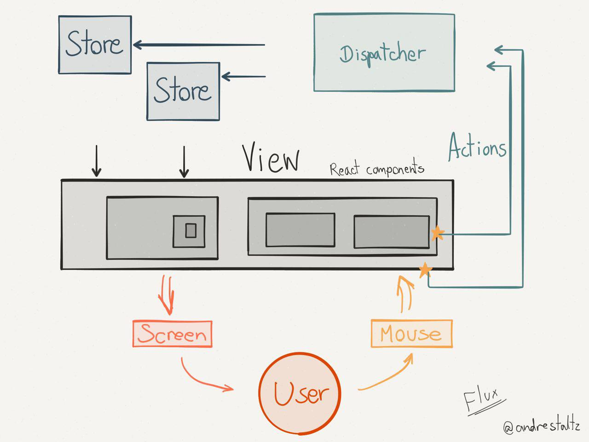

# React & Redux

<!-- vertical -->

## JSX

* HTML tag must be lower-case
* User-Defined Components Must Be Capitalized
* Add `import React from 'react';` wherever you use JSX

<!-- vertical -->

## `props` and `state`

<!-- vertical -->

### `props`

**Declaration**:

```jsx
<User name="yan" age="18" />
```

**Read**

```jsx
class User extends Component {
    render() {
        return <div>{this.props.name}</div>
    }
}
```

**Write**

not modifiable

<!-- vertical -->

**Functional Component**

```jsx
function User(props) {
    render() {
        // return <div>{props.name}</div>
        return (
            <div>{props.name}</div>
        )
    }
}
```

It's recommended to use `()` after `return` to avoid subtle syntax error

<!-- vertical -->

`props.children` : [Composition vs Inheritance – React](https://reactjs.org/docs/composition-vs-inheritance.html "")

```jsx
function FancyBorder(props) {
  return (
    <div className={'FancyBorder FancyBorder-' + props.color}>
      {props.children}
    </div>
  );
}

function WelcomeDialog() {
  return (
    <FancyBorder color="blue">
      <h1 className="Dialog-title">
        Welcome
      </h1>
      <p className="Dialog-message">
        Thank you for visiting our spacecraft!
      </p>
    </FancyBorder>
  );
}
```

<!-- vertical -->

`PropTypes`

```js
import PropTypes from 'prop-types';
// import {PropTypes} from 'react'; // before react 15.5

MyComponent.propTypes = {
  // You can declare that a prop is a specific JS type. By default, these
  // are all optional.
  optionalFunc: PropTypes.func,
  optionalNumber: PropTypes.number,
  optionalString: PropTypes.string,

  // You can ensure that your prop is limited to specific values by treating
  // it as an enum.
  optionalEnum: PropTypes.oneOf(['News', 'Photos']),

  // An object that could be one of many types
  optionalUnion: PropTypes.oneOfType([
    PropTypes.string,
    PropTypes.number,
    PropTypes.instanceOf(Message)
  ])
};
```

<!-- vertical -->

Props type check only works in development mode, ignored in production


<!-- vertical -->


### `state`

**Declaration**

```jsx
class Clock extends React.Component {
	state = {
		time: 0
	}

	componentDidMount() {
		this.id = setInterval(() => {
			this.setState({ time: this.state.time + 1 }, () => {
				console.log('callback ' + this.state.time); // return 1 after setState
			})
		}, 1000); // will run asynchronously
		console.log('subsequence ' + this.state.time); // return 0 instead of 1
	}

	render() {
		return <div>{this.state.time}</div>
	}
}
```

<!-- vertical -->

**Read**

 `this.state.time`

**Write**

1. ~~`this.state.variable = newVar`~~
  * only sets value and can't trigger re-render, do not use

2. `this.setState(newState[, callback])` 
  * change `this.state` and invoke re-render
  * React will combine multiple `setState()`  into one change and then run callback


<!-- vertical -->

###  `props` versus `state`

| Comparison   | `props`                      | `state`                                  |
| ------------ | ---------------------------- | ---------------------------------------- |
| Usage        | data from parent to children | inner state of a component               |
| Modification | unmodifiable                 | call `setState()` from inside or outside |
|              |                              |                                          |

<!-- vertical -->

### Context

From grandparent component to grandchildren component

Not used very often

```js
import PropTypes from 'prop-types';

      class Child extends React.Component {

        static contextTypes = {
          text: PropTypes.string
        }

        render () {
          return <div> {this.context.text} </div>;
        }
      }

      class Ancestor extends React.Component {
        static childContextTypes = {
          text: PropTypes.string
        }

        getChildContext() {
          return {text: 'ancestor'};
        }
      }
```

<!-- vertical -->

### Action Callback


### `ref`

```js
class UseRef extends React.Component {
  constructor(props) {
    super(props);
    this.state = { userInput: '' };
  }

  handleChange = (e) => {
    this.setState({ userInput: e.target.value }, () => {
      console.log('handleChange ' + JSON.stringify(this.state));
    });
  }

  clearAndFocusInput = () => {
    this.setState({ userInput: '' }, () => { // callback function
      console.log('ref theInput');
      window.theInput = ReactDOM.findDOMNode(this.refs.theInput);
      ReactDOM.findDOMNode(this.refs.theInput).focus();
      // this.refs.theInput.getDOMNode().focus(); // old style: before react v0.14

      // console.log('ref callback theInput');
      // window.theInput = this.theInput;
      // this.theInput.focus();
    });
  }

  render() {
    return (
      <div>
        <input
          type='button'
          onClick={this.clearAndFocusInput}
          value='Click to focus and clear'
        />
        <br />
        <input
          ref='theInput'
          // ref={(compInstance) => {this.theInput = compInstance;}}
          value={this.state.userInput}
          onChange={this.handleChange}
        />
      </div>);
  }
}
```


[Refs and the DOM – React](https://reactjs.org/docs/refs-and-the-dom.html "")

<!-- vertical -->

## High Order Component

```jsx
import {Component} from React;

function hoc(Comp) {
    return class EnhancedComponent extends Component {
        extendFunc() {
            // enhance component behavior
        }

        render() {
            return (
                <Comp {...this.props} />
            )
        }
    }
}
const newComp = hoc(aComp);
```

<!-- vertical -->

```jsx
function transProps(transFunc) {
    return function(Comp) {
        return class extends Component {
            render() {
                return <Comp {...transFunc(this.props)} />
            }
        }
    }
}
const newAdapter = transProps(transPropsFunc)(aComp);
```

<!-- vertical -->

## VirtualDOM


<!-- vertical -->

TODO: add VDOM and Real DOM image

Note:
[The Inner Workings Of Virtual DOM – rajaraodv – Medium](https://medium.com/@rajaraodv/the-inner-workings-of-virtual-dom-666ee7ad47cf "")
[How Virtual-DOM and diffing works in React – Gethyl George Kurian – Medium](https://medium.com/@gethylgeorge/how-virtual-dom-and-diffing-works-in-react-6fc805f9f84e "")
[Virtual DOM: How inefficiency can lead to better performance - AFAS Dev](https://dev.afas.nl/blog-dev/virtual-dom-how-inefficiency-can-lead-to-better-performance "")
[Understanding the Virtual DOM](https://bitsofco.de/understanding-the-virtual-dom/ "")
[The Real Benefits of the Virtual DOM in React.js](https://www.accelebrate.com/blog/the-real-benefits-of-the-virtual-dom-in-react-js/ "")

<!-- vertical -->

## Life Cycle

When will a compoent redraw?

1. Parent `props` update
   * `componentWillReceiveProps()`
   * `shouldComponentUpdate()`
   * `componentWillUpdate()`
   * `render()`
   * `componentDidUpdate()`
<!-- vertical -->
2. Own `state` change
   * `shouldComponentUpdate()`
   * `componentWillUpdate()`
   * `render()`
   * `componentDidUpdate()`
<!-- vertical -->
3. `this.forceUpdate()`
   * `componentWillUpdate()`
   * `render()`
   * `componentDidUpdate()`
<!-- vertical -->


`shouldComponentUpdate()` is mostly used to reduce unnecessary redraw to improve performance, `componentWillReceiveProps()` is generally used to sync new `props` to `state`

`componentWillUnmount()` is used to clean resources 

<!-- vertical -->

```js
class WindowWidth extends React.Component {
    constructor(props) {
        super(props);
        this.state = { windowWidth: window.innerWidth };
        // manually bind this
        this.onWindowResize = this.onWindowResize.bind(this);
    }

    onWindowResize(event) {
        this.setState({ windowWidth: window.innerWidth });
    }

    componentDidMount() {
        window.addEventListener('resize', this.onWindowResize);
    }
    componentWillUnmount() {
        window.removeEventListener('resize', this.onWindowResize);
        // should have exactly same params as addEventListener!
    }

    render() {
        return (<div>Window width: {this.state.windowWidth} </div>);
    }
}
```
<!-- vertical -->

[Get and debug event listeners &nbsp;|&nbsp; Web      &nbsp;|&nbsp; Google Developers](https://developers.google.com/web/updates/2015/05/get-and-debug-event-listeners "")

[javascript - When does a component unmount? - Stack Overflow](https://stackoverflow.com/questions/41498756/when-does-a-component-unmount "")

TODO: when will datagrid be unmounted ?


<!-- vertical -->


<!-- vertical -->


<!-- vertical -->


<!-- vertical -->


<!-- vertical -->

[ReactJs component lifecycle methods — A deep dive – Hacker Noon](https://hackernoon.com/reactjs-component-lifecycle-methods-a-deep-dive-38275d9d13c0 "")


<!-- vertical -->


## Data Flow

[What Does Redux Do? (and when should you use it?)](https://daveceddia.com/what-does-redux-do/ "") ✔✔✔✔

[How Redux Works: A Counter-Example ](https://daveceddia.com/how-does-redux-work/ "") ✔✔✔✔


<!-- vertical -->



<!-- vertical -->


<!-- vertical -->


<!-- vertical -->


这一部分可以参考 [自述 · GitBook](http://cn.redux.js.org/index.html "")

```js


import { createStore } from 'redux'

/**
 * 这是一个 reducer，形式为 (state, action) => state 的纯函数。
 * 描述了 action 如何把 state 转变成下一个 state。
 *
 * state 的形式取决于你，可以是基本类型、数组、对象、
 * 甚至是 Immutable.js 生成的数据结构。惟一的要点是
 * 当 state 变化时需要返回全新的对象，而不是修改传入的参数。
 *
 * 下面例子使用 `switch` 语句和字符串来做判断，但你可以写帮助类(helper)
 * 根据不同的约定（如方法映射）来判断，只要适用你的项目即可。
 */
function counter(state = 0, action) {
  switch (action.type) {
    case 'INCREMENT':
      return state + 1
    case 'DECREMENT':
      return state - 1
    default:
      return state
  }
}

// 创建 Redux store 来存放应用的状态。
// API 是 { subscribe, dispatch, getState }。
let store = createStore(counter)

// 可以手动订阅更新，也可以事件绑定到视图层。
store.subscribe(() => console.log(store.getState()))

// 改变内部 state 惟一方法是 dispatch 一个 action。
// action 可以被序列化，用日记记录和储存下来，后期还可以以回放的方式执行
store.dispatch({ type: 'INCREMENT' })
// 1
store.dispatch({ type: 'INCREMENT' })
// 2
store.dispatch({ type: 'DECREMENT' })
// 1
```

<!-- vertical -->

Action

* action creator

Reducer

* `(old_state, action) => new_state`
* should be pure function, return new object instead of modifing old object
* design your own state tree, don't nest too deep

Dispatcher

Middleware

Store Enhancer


<!-- vertical -->


## fetch and thunk


<!-- vertical -->


<!-- vertical -->


<!-- vertical -->

[淺談 Redux Thunk](https://www.slideshare.net/ssuserc4dc6d1/redux-thunk "")

[[ Part 3 ] First Async call, redux-thunk](http://dev.basharallabadi.com/2018/09/part-3-first-async-call-redux-thunk.html "")

[Quick Start · React Redux](https://react-redux.js.org/introduction/quick-start "")


[javascript - Fetch API request timeout? - Stack Overflow](https://stackoverflow.com/questions/46946380/fetch-api-request-timeout "")

```js
// Rough implementation. Untested.
function timeout(ms, promise) {
  return new Promise(function(resolve, reject) {
    setTimeout(function() {
      reject(new Error("timeout"))
    }, ms)
    promise.then(resolve, reject)
  })
}

timeout(1000, fetch('/hello')).then(function(response) {
  // process response
}).catch(function(error) {
  // might be a timeout error
})
```

<!-- vertical -->

## Usual Component

### IntlProvider

`window.Intl`


### Provider

store

### DragNDrop

HTML5 Drag and Drop

<!-- vertical -->

### `classnames`

```javascript
import classNames from 'classnames';

classNames('foo', { bar: true, duck: false}, 'baz': true); // "foo bar baz"
classNames('a', ['b', {c: true, d: false}]) // "a b c"
let btnType = 'primary';
classNames({ [`btn-${btnType}`]: true }); // "btn-primary"
```

TODO: add real example


<!-- vertical -->

### Integrate with jQuery

`npm install jquery --save`

```js
import $ from jquery;
var rootEle = this.refs.root;
// jQuery change ref node to modal message box
$(rootEle).modal({backdrop: 'static', keyboard: false, show: false});
// jQuery bind event
$(rootELe).on('hidden.bs.modal', this.handleHidden);
```

[javascript - How to use JQuery with ReactJS - Stack Overflow](https://stackoverflow.com/questions/38518278/how-to-use-jquery-with-reactjs "")


<!-- vertical -->