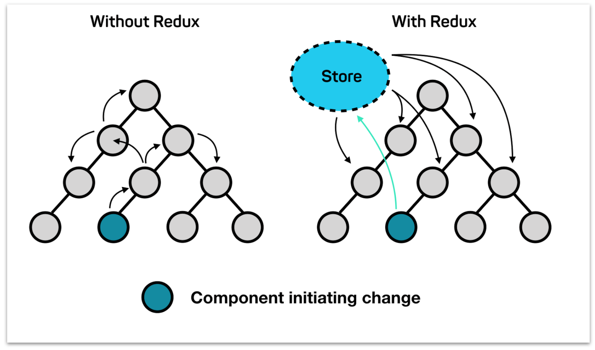

# React & Redux

<!-- vertical -->

## React

* Declarative programming, DOM operations are encapsulated
* Component oriented, JavaScript (JSX) + CSS
* Virtual DOM, render to Web or native app

<!-- vertical -->

## VirtualDOM


Note:

TODO: add VDOM and Real DOM image

[The Inner Workings Of Virtual DOM – rajaraodv – Medium](https://medium.com/@rajaraodv/the-inner-workings-of-virtual-dom-666ee7ad47cf "")
[How Virtual-DOM and diffing works in React – Gethyl George Kurian – Medium](https://medium.com/@gethylgeorge/how-virtual-dom-and-diffing-works-in-react-6fc805f9f84e "")
[Virtual DOM: How inefficiency can lead to better performance - AFAS Dev](https://dev.afas.nl/blog-dev/virtual-dom-how-inefficiency-can-lead-to-better-performance "")
[Understanding the Virtual DOM](https://bitsofco.de/understanding-the-virtual-dom/ "")
[The Real Benefits of the Virtual DOM in React.js](https://www.accelebrate.com/blog/the-real-benefits-of-the-virtual-dom-in-react-js/ "")

<!-- vertical -->

## Top-Level API

```js
React.createElement(
  type,
  [props],
  [...children]
)
```

Note: [React Top-Level API – React](https://reactjs.org/docs/react-api.html "")

<!-- vertical -->

## JSX

> JSX, or JavaScript XML, is an extension to the JavaScript language syntax.

* If first-letter of tag is capitalized then User defined components otherwise HTML tag
* Attributes: `className` -> `class`; `onClick` -> `onclick`
* Add `import React from 'react';` wherever you use JSX

<!-- vertical -->

```jsx
import React from 'react';

class ClickCounter extends Component {

  constructor(props) {
    super(props);
    this.onClickButton = this.onClickButton.bind(this);
    this.state = { count: 0 };
  }

  onClickButton() {
    this.setState({count: this.state.count + 1});
  }

  render() {
    return (
      <div style={{margin: '16px'}}>
        <button onClick={this.onClickButton}>Click Me</button>
        <div>
          Click Count: <span id="clickCount">{this.state.count}</span>
        </div>
      </div>
    );
  }
}
```

<!-- vertical -->

## `props` and `state`

<!-- vertical -->

### `props`

Declaration:

```jsx
<User name="yan" age="30"></User>
```

Read:

```jsx
class User extends Component {
    render() {
        // this.props.age = "18"; // TypeError
        return <div>{this.props.name}</div>
    }
}
```

Write: `TypeError: Cannot assign to read only property`

<!-- vertical -->

**Functional Component**

```jsx
function User(props) {
	render() {
		// return <div>{props.name}</div> // better wrapped with ()
		return (
			<div>{props.name}</div>
		);
	}
}
```

* Component that do not need its own state
* Read `props` insteaf of `this.props`
* It's recommended to use `()` after `return` to avoid Automatic Semicolon Insertion

Note: [Understanding Automatic Semicolon Insertion in JavaScript](http://www.bradoncode.com/blog/2015/08/26/javascript-semi-colon-insertion/ "")

<!-- vertical -->

`props.children` : [Try Me](https://codepen.io/gaearon/pen/ozqNOV?editors=0010 )

```jsx
function FancyBorder(props) {
  return (
    <div className={'FancyBorder FancyBorder-' + props.color}>
      {props.children}
    </div>
  );
}

function WelcomeDialog() {
  return (
    <FancyBorder color="blue">
      <h1 className="Dialog-title">
        Welcome
      </h1>
      <p className="Dialog-message">
        Thank you for visiting our spacecraft!
      </p>
    </FancyBorder>
  );
}
```

Note: [Composition vs Inheritance – React](https://reactjs.org/docs/composition-vs-inheritance.html "")

<!-- vertical -->

**PropTypes**

```js
import PropTypes from 'prop-types';
// import {PropTypes} from 'react'; // before react 15.5

MyComponent.propTypes = {
  // You can declare that a prop is a specific JS type. By default, these
  // are all optional.
  optionalFunc: PropTypes.func,
  optionalNumber: PropTypes.number,
  optionalString: PropTypes.string,

  // You can ensure that your prop is limited to specific values by treating
  // it as an enum.
  optionalEnum: PropTypes.oneOf(['News', 'Photos']),

  // An object that could be one of many types
  optionalUnion: PropTypes.oneOfType([
    PropTypes.string,
    PropTypes.number,
    PropTypes.instanceOf(Message)
  ])
};
```

<!-- vertical -->

Props type check only works in development mode, ignored in production


<!-- vertical -->


### `state`

Declaration:

```jsx
	constructor(props) {
		super(props);
		this.state = {
			time: 0
		}
	}
```

Read: `this.state.time`

<!-- vertical -->

Write:

1. ~~`this.state.variable = newVar`~~
  * only sets value and can't trigger re-render, do not use

2. `this.setState(newState[, callback])` 
  * change `this.state` and invoke re-render
  * React will combine multiple `setState()`  into one change and then run callback
  * Asynchronous call: append operation to current event loop

<!-- vertical -->

```jsx
class AsyncSetState extends React.Component {
	constructor(props) {
		super(props);
		this.state = { time: 0 };
		console.log('init ' + this.state.time); // 0
	}
	
	componentDidMount() {
		this.setState({time: this.state.time + 1}, () => {
			console.log('callback ' + this.state.time); // return 1 after setState
		});
		console.log('subsequence ' + this.state.time); // return 0 instead of 1
	}
	
	render() {
		console.log('render ' + this.state.time); // 1st time 0, 2nd time 1
		return <div>this.state.time: {this.state.time}</div>
	}
}
```

<!-- vertical -->

###  `props` versus `state`

| Comparison   | `props`                      | `state`                                  |
| ------------ | ---------------------------- | ---------------------------------------- |
| Usage        | data from parent to children | inner state of a component               |
| Modification | unmodifiable                 | call `setState()` from inside or outside |
|              |                              |                                          |

<!-- vertical -->

## context

> Context provides a way to share values like these between components without having to explicitly pass a prop through every level of the tree.

* From ancestor to descendant component
* It's better to user `context` for app level state, such as `Provider` provides `store`

Note: [Context – React](https://reactjs.org/docs/context.html "")

<!-- vertical -->

```js
import PropTypes from 'prop-types';

class Ancestor extends React.Component {
	static childContextTypes = {
		text: PropTypes.string
	};

	getChildContext() {
		return { text: 'This is ancestor' };
	};

	render() {
		return (
			<span>{"ANCESTOR -> "}{this.props.children}</span>
		);
	};
};
```

<!-- vertical -->

```javascript
class Child extends React.Component {

	static contextTypes = {
		text: PropTypes.string
	};

	render() {
		return (<div>{"CHILD -> " + this.context.text}</div>);
	};
}
```
<!-- vertical -->

## From child to parent

* pass callback function to child
* use `ref` to read child status or DOM

<!-- vertical -->

### callback

TODO add example

<!-- vertical -->


### `ref`

* get child component real DOM reference after `componentDidMount()` and `componentDidUpdate()`
* Define ref:
	- `<Child ref="nameInput"/>`
	- `<Child ref={(input) => this.nameInput = input} />`

<!-- vertical -->

```js
class SimpleRef extends React.Component {
	constructor(props) {
		super(props);
		setTimeout(() => {
			console.log(this.nameInput.value);
			this.nameInput.focus(); // focus on text input
			window.inputDOM = ReactDOM.findDOMNode(this.nameInput);
			// try window.inputDOM.value = 'any'
		}, 8000); // read input text after 8s
	}

	render() {
		// ref callback will be triggered after 
		// componentDidMount and componentDidUpdate
		return (
			<input ref={(input) => this.nameInput = input} type="text" />
		);
	}
}
```

Note: [Refs and the DOM – React](https://reactjs.org/docs/refs-and-the-dom.html "")

<!-- vertical -->

## High Order Component

```jsx
import {React} from React;

function hoc(Comp) {
    return class EnhancedComponent extends React.Component {
        extendFunc() {
            // enhance component behavior
        }

        render() {
            return (
                <Comp {...this.props} />
            )
        }
    }
}
const newComp = hoc(aComp);
```

<!-- vertical -->

```jsx
function transProps(transFunc) {
    return function(Comp) {
        return class extends Component {
            render() {
                return <Comp {...transFunc(this.props)} />
            }
        }
    }
}
const newAdapter = transProps(transPropsFunc)(aComp);
```

<!-- vertical -->

## Component Life Cycle

* Mounting -> Updating -> Unmounting
* Hook functions provided by React

<!-- vertical -->


Note:
[React lifecycle methods diagram](http://projects.wojtekmaj.pl/react-lifecycle-methods-diagram/ "")

<!-- vertical -->


<!-- vertical -->

Mounting

* `constructor()`
  - set initial value for state
* `componentWillMount()`
* `render()`
  - should be pure function
  - draw UI with initial state
* `componentDidMount()`
  - usually dispatch load data action

<!-- vertical -->

Updating - When will a component redraw?

1. Parent `props` update
   * `componentWillReceiveProps(nextProps)`
   * `shouldComponentUpdate(nextProps, nextState)`
   * `componentWillUpdate(nextProps, nextState)`
   * `render()`
   * `componentDidUpdate(prevProps, prevState)`
<!-- vertical -->
2. Own `state` change
   * `shouldComponentUpdate(nextProps, nextState)`
   * `componentWillUpdate(nextProps, nextState)`
   * `render()`
   * `componentDidUpdate(prevProps, prevState)`
<!-- vertical -->
3. `this.forceUpdate()`
   * `componentWillUpdate(nextProps, nextState)`
   * `render()`
   * `componentDidUpdate(prevProps, prevState)`
<!-- vertical -->

* `componentWillReceiveProps(nextProps)`
  - usually sync `props` change to component `state`
  - unsafe in React 16
* `shouldComponentUpdate(nextProps, nextState)`
  - currProps -> `this.props`, currState -> `this.state`
  - need to re-render given new props and state ? return `true` by default implementation
  - reduce unnecessary `render()` to improve performance
<!-- vertical -->
* `componentWillUpdate(nextProps, nextState)`
  - perform preparation before an update occurs. 
  - unsafe in React 16
* `componentDidUpdate(prevProps, prevState)`
  - invoked immediately after updating occurs
  - `setState()` here may cause infinite loop, be very careful

Note:


<!-- vertical -->
Unmounting

* `componentWillUnmount()`
  - usually corresponding to `componentDidMount()`
  - should release resource: clear timer, remove event listener
  - will be called if be parent component re-render

<!-- vertical -->

```js
class WindowWidth extends React.Component {
	constructor(props) {
		super(props);
		this.state = { windowWidth: window.innerWidth };
		// manually bind this
		this.onWindowResize = this.onWindowResize.bind(this);
	}

	onWindowResize(event) {
		this.setState({ windowWidth: window.innerWidth });
	}

	componentDidMount() {
		window.addEventListener('resize', this.onWindowResize);
	}
	componentWillUnmount() {
		window.removeEventListener('resize', this.onWindowResize);
		// should have exactly same params as addEventListener!
	}

	render() {
		return (<div>Window width: {this.state.windowWidth} </div>);
	}
}
```

<!-- vertical -->


Note:
[Get and debug event listeners &nbsp;|&nbsp; Web      &nbsp;|&nbsp; Google Developers](https://developers.google.com/web/updates/2015/05/get-and-debug-event-listeners "")

[javascript - When does a component unmount? - Stack Overflow](https://stackoverflow.com/questions/41498756/when-does-a-component-unmount "")

TODO: when will datagrid be unmounted ?

<!-- vertical -->


## Redux: one-way data flow



<!-- vertical -->

## Flux

* Intended to be used in companion with React
* Similar to traditional MVC pattern
  - React as View
  - Store as Model
  - Action + Dispatcher as Controller

<!-- vertical -->


Note:

[Flux vs MVC Design Pattern - Madasamy M - Medium](https://medium.com/@madasamy/flux-vs-mvc-design-pattern-de134dfaa12b "")

<!-- vertical -->

### Redux VS Flux

* Created by Dan Abramov
* `Redux = reducer + Flux`
* More strict to control data flow than Flux
  - Single source of truth
  - Dispatcher got simplified to `store.dispatch()`
  - State is read-only (no direct write)
  - Changes are made with pure functions (`reducer`)

Note: 

[What Does Redux Do? (and when should you use it?)](https://daveceddia.com/what-does-redux-do/ "") ✔✔✔✔

[How Redux Works: A Counter-Example ](https://daveceddia.com/how-does-redux-work/ "") ✔✔✔✔

<!-- vertical -->


Note:


<!-- vertical -->


<!-- vertical -->

* `redux` gives you a store, and lets you keep state in it, and get state out, and respond when the state changes
* `react-redux` lets you connect pieces of the state to React components

<!-- vertical -->

```js
import { createStore } from 'redux';
import { Provider } from 'react-redux';

const initialState = {
  count: 10
};

function reducer(state = initialState, action) {
  switch(action.type) {
    case 'INCREMENT':
      return {
        count: state.count + 1
      };
    case 'DECREMENT':
      return {
        count: state.count - 1
      };
    default:
      return state;
  }
}

const store = createStore(reducer);

render(
  <Provider store={store}>
    <Counter />
  </Provider>
)
```

<!-- vertical -->

```js
import { connect } from 'react-redux';

function mapStateToProps(state) {
  return {
    count: state.count
  };
}

class Counter extends React.Component {

	increment = () => {
		this.props.dispatch({ type: 'INCREMENT'});
	}

	decrement = () => {
		this.props.dispatch({ type: 'DECREMENT'});
	}

	render() {
		return (
			<div>
				<h3>Counter</h3>
				<div>
					<button onClick={this.decrement}> - </button>
					<span>{this.props.count}</span>
					<button onClick={this.increment}> + </button>
				</div>
			</div>
		)
	}
}

export default connect(mapStateToProps)(Counter);
```

<!-- vertical -->

```js
import { createStore } from 'redux'

/**
 * 这是一个 reducer，形式为 (state, action) => state 的纯函数。
 * 描述了 action 如何把 state 转变成下一个 state。
 *
 * state 的形式取决于你，可以是基本类型、数组、对象、
 * 甚至是 Immutable.js 生成的数据结构。惟一的要点是
 * 当 state 变化时需要返回全新的对象，而不是修改传入的参数。
 *
 * 下面例子使用 `switch` 语句和字符串来做判断，但你可以写帮助类(helper)
 * 根据不同的约定（如方法映射）来判断，只要适用你的项目即可。
 */
function counter(state = 0, action) {
	switch (action.type) {
		case 'INCREMENT':
			return state + 1
		case 'DECREMENT':
			return state - 1
		default:
			return state
	}
}

// 创建 Redux store 来存放应用的状态。
// API 是 { subscribe, dispatch, getState }。
let store = createStore(counter)

// 可以手动订阅更新，也可以事件绑定到视图层。
store.subscribe(() => console.log(store.getState()))

// 改变内部 state 惟一方法是 dispatch 一个 action。
// action 可以被序列化，用日记记录和储存下来，后期还可以以回放的方式执行
store.dispatch({ type: 'INCREMENT' })
// 1
store.dispatch({ type: 'INCREMENT' })
// 2
store.dispatch({ type: 'DECREMENT' })
// 1
```

Note:

TODO: [Understanding Redux: The World’s Easiest Guide to Beginning Redux](https://www.freecodecamp.org/news/understanding-redux-the-worlds-easiest-guide-to-beginning-redux-c695f45546f6/ "")

这一部分可以参考 [自述 · GitBook](http://cn.redux.js.org/index.html "")

<!-- vertical -->

`createStore()` A simplified version

```js
function createStore(reducer) {
    var state;
    var listeners = [];

    function getState() {
        return state;
    }
    
    function subscribe(listener) {
        listeners.push(listener);
        return unsubscribe() {
            var index = listeners.indexOf(listener)
            listeners.splice(index, 1)
        };
    }
    
    function dispatch(action) {
        state = reducer(state, action);
        listeners.forEach(listener => listener());
    }
+
    dispatch({type: '@@redux/INIT'}); // initial action

    return { dispatch, subscribe, getState };
}
```

<!-- vertical -->

Action

<!-- vertical -->

Action Creator

```js
function bindActionCreator(actionCreator, dispatch) {
  return (...args) => dispatch(actionCreator(...args))
}

export default function bindActionCreators(actionCreators, dispatch) {
  if (typeof actionCreators === 'function') {
    return bindActionCreator(actionCreators, dispatch)
  }

  if (typeof actionCreators !== 'object' || actionCreators === null) {
    throw new Error(
      `bindActionCreators expected an object or a function, instead received ${actionCreators === null ? 'null' : typeof actionCreators}. ` +
      `Did you write "import ActionCreators from" instead of "import * as ActionCreators from"?`
    )
  }

  const keys = Object.keys(actionCreators)
  const boundActionCreators = {}
  for (let i = 0; i < keys.length; i++) {
    const key = keys[i]
    const actionCreator = actionCreators[key]
    if (typeof actionCreator === 'function') {
      boundActionCreators[key] = bindActionCreator(actionCreator, dispatch)
    }
  }
  return boundActionCreators
}
```

<!-- vertical -->

mapStateToProps
mapDispatchToProps

<!-- vertical -->

Reducer

* `(old_state, action) => new_state`
* should be pure function, return new object instead of modifing old object
* design your own state tree, don't nest too deep

Dispatcher

<!-- vertical -->

Middleware

```js
/**
 * Logs all actions and states after they are dispatched.
 */
const logger = store => next => action => {
  console.group(action.type)
  console.info('dispatching', action)
  let result = next(action)
  console.log('next state', store.getState())
  console.groupEnd(action.type)
  return result
}

let createStoreWithMiddleware = applyMiddleware(logger)(createStore)

let yourApp = combineReducers(reducers)
let store = createStoreWithMiddleware(yourApp)
```

Note:
[javascript - While debugging, can I have access to the Redux store from the browser console? - Stack Overflow](https://stackoverflow.com/questions/34373462/while-debugging-can-i-have-access-to-the-redux-store-from-the-browser-console "")


<!-- vertical -->

Store Enhancer


<!-- vertical -->


## fetch and thunk

<!-- vertical -->


<!-- vertical -->


<!-- vertical -->


<!-- vertical -->

[淺談 Redux Thunk](https://www.slideshare.net/ssuserc4dc6d1/redux-thunk "")

[[ Part 3 ] First Async call, redux-thunk](http://dev.basharallabadi.com/2018/09/part-3-first-async-call-redux-thunk.html "")

[Quick Start · React Redux](https://react-redux.js.org/introduction/quick-start "")


[javascript - Fetch API request timeout? - Stack Overflow](https://stackoverflow.com/questions/46946380/fetch-api-request-timeout "")

```js
// Rough implementation. Untested.
function timeout(ms, promise) {
  return new Promise(function(resolve, reject) {
    setTimeout(function() {
      reject(new Error("timeout"))
    }, ms)
    promise.then(resolve, reject)
  })
}

timeout(1000, fetch('/hello')).then(function(response) {
  // process response
}).catch(function(error) {
  // might be a timeout error
})
```

<!-- vertical -->

## Common Component

### IntlProvider

`window.Intl`


### Provider

store

### DragNDrop

HTML5 Drag and Drop

<!-- vertical -->

### `classnames`

```javascript
import classNames from 'classnames';

classNames('foo', { bar: true, duck: false}, 'baz': true); // "foo bar baz"
classNames('a', ['b', {c: true, d: false}]) // "a b c"
let btnType = 'primary';
classNames({ [`btn-${btnType}`]: true }); // "btn-primary"
```

<!-- vertical -->

### Integrate with jQuery

`npm install jquery --save`

```js
import $ from jquery;
var rootEle = this.refs.root;
// jQuery change ref node to modal message box
$(rootEle).modal({backdrop: 'static', keyboard: false, show: false});
// jQuery bind event
$(rootELe).on('hidden.bs.modal', this.handleHidden);
```

Note: 
[javascript - How to use JQuery with ReactJS - Stack Overflow](https://stackoverflow.com/questions/38518278/how-to-use-jquery-with-reactjs "")

<!-- vertical -->

## React Start Up

1. Local HTML Template
2. Online CodePen
3. `create-react-app`
  - Recommended

<!-- vertical -->

### Local HTML Template

* [download this HTML template](https://raw.githubusercontent.com/reactjs/reactjs.org/master/static/html/single-file-example.html)
* handy for quick small testing, should not use in production
* write React code inside `text/babel` script block
* not able to import 3rd party libraries

<!-- vertical -->

```html
<!DOCTYPE html>
<html>
<head>
  <meta charset="UTF-8" />
  <title>Hello World</title>
</head>
<body>
  <div id="root"></div>
	<script type="text/babel">
		ReactDOM.render(
			<h1>Hello, world!</h1>,
			document.getElementById('root')
		);
	</script>
	
	<script src="https://unpkg.com/react@16/umd/react.development.js"></script>
	<script src="https://unpkg.com/react-dom@16/umd/react-dom.development.js"></script>
	<script src="https://unpkg.com/babel-standalone@6.15.0/babel.min.js"></script>

</body>
</html>
```
<!-- vertical -->

### Online CodePen

[A Pen by Dan Abramov](https://codepen.io/gaearon/pen/ozqNOV?editors=0010 "")

* HTML/CSS/JS(Babel)
* Do not paste code

<!-- vertical -->

### `create-react-app`

```bash
$ create-react-app proj_name
$ npm start     # http://localhost:3000/
$ npm run eject # eject hidden config files and can't revert back
```

* boilerplate
* HMR